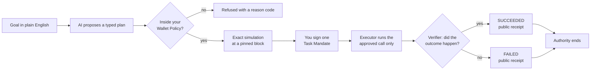
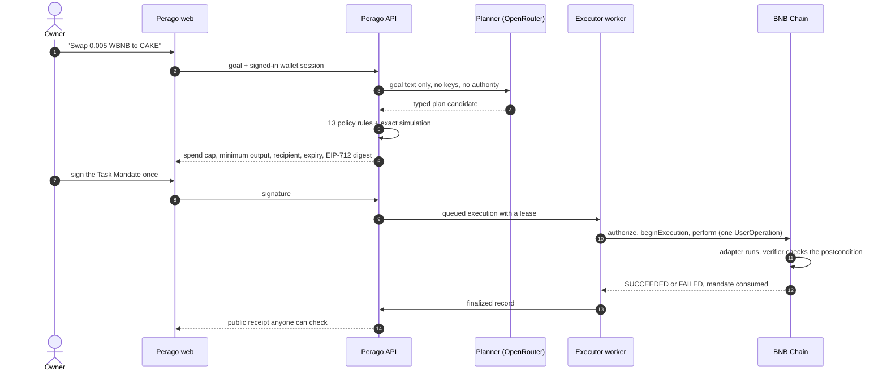
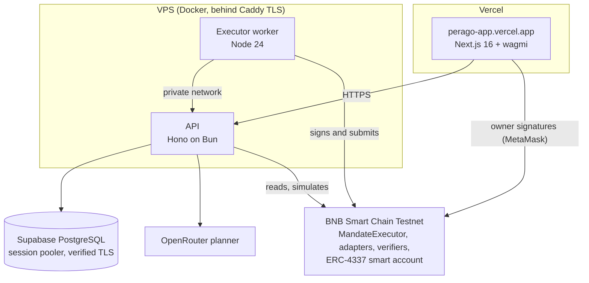

<div align="center">


### Give the goal, not the wallet.

Perago turns a plain-English goal into a one-time onchain mandate, runs it inside hard limits, proves the outcome, and then drops its authority for good.

[Open the app](https://perago-app.vercel.app) · [API health](https://perago-api.43-129-38-115.nip.io/health) · [Onchain evidence](#onchain-evidence) · [How it works](#how-it-works)

-F0B90B?logo=binance&logoColor=white)


</div>

> Perago is in active development. The live demo covers one PancakeSwap V3 swap and one CAKE Pool stake on BNB Smart Chain Testnet. More protocol integrations for staking, swapping, and payments are on the way.

## The problem

AI agents are good at turning "put 0.01 WBNB into CAKE" into a transaction. The hard part is letting them do it without handing over the wallet. Most agent setups today give the bot a private key or a broad session key, trust the prompt to keep it in bounds, and treat a transaction hash as proof that the job was done.

Perago splits the two jobs. The AI only reads the goal and proposes a typed plan. Everything that grants or checks authority is deterministic: your wallet policy, an exact simulation, a mandate you sign once, contracts that allow one call, and a verifier that checks the result onchain.

## With and without Perago

| | A typical agent wallet | Perago |
| --- | --- | --- |
| What the agent holds | A private key or a broad session that can move any asset | One signed mandate for one action, with hard limits |
| How long an approval lasts | Until someone remembers to revoke it | A mandate is one use. Success, failure, expiry, or revocation ends it for good |
| Who sets the limits | Prompt text and the model's judgment | Your Wallet Policy. The AI can narrow a plan but can never widen it |
| What it can call | Often arbitrary calldata and unlimited token approvals | One allowlisted target and function selector. Token allowance is capped by your policy and cleared when you revoke it |
| Slippage and minimum output | Chosen by the agent at run time | Simulated at a pinned block, signed by you, checked onchain |
| Proof of the outcome | A transaction hash, which only shows that something ran | An adapter-specific verifier checks the postcondition and writes a public receipt |
| Replays | Up to the app | The contract refuses a consumed mandate. Replays were tried on testnet and refused |
| Your keys | Sometimes pasted into a bot or server | Stay in your wallet. The model and the API never see them |
| Paying the agent (next phase) | Trust, or the model grading its own work | Released only after deterministic success, through an ERC-8183 evaluator (fork-proven) |

## How it works



The same journey, step by step:



What each piece is responsible for:

- Your ERC-4337 smart account (Alchemy Modular Account V2) holds the funds. You stay the root owner.
- A Wallet Policy you activate once sets the assets, caps, and protocols an executor may ever touch. Protected assets can never be spent.
- The planner turns text into a closed plan type. It cannot add authority, and a plan outside the policy is refused rather than clamped.
- The API compiles the plan, runs 13 policy rules, simulates the exact call, and builds the 22-field `TaskMandate` you sign with EIP-712.
- `MandateExecutor` checks the signature, nonce, expiry, spend bounds, recipient, action hash, and postcondition hash. It marks the mandate consumed before the call and records a terminal status after it.
- The swap and stake adapters make one call each. Their verifiers read the chain afterwards and decide success from balances and pool shares, not from the model.
- The worker is the only process holding the executor key. It has no power beyond what the signed mandate allows, and a crash or duplicate delivery cannot submit twice.

## Architecture



Onchain state wins over the database. The API rebuilds receipts from finalized chain events, and no database row can turn a failed mandate into a success.

## Onchain evidence

Everything below is on BNB Smart Chain Testnet (chain 97). Pinned addresses and code hashes are in [`deployments/`](deployments/). The `docs/` evidence and specifications are local-only and are not included in a fresh clone.

### Deployed contracts

None of these contracts has an owner, admin, or upgrade path. All seven were source-verified on Sourcify with a full creation and runtime bytecode match; the public verification pages are linked below.

| Contract | Address | Creation tx | Source |
| --- | --- | --- | --- |
| MandateExecutor (production, needs a bound ERC-8183 job) | [`0xc618…EC66`](https://testnet.bscscan.com/address/0xc6184Fb3e12F4C79b50f37175f3229d91664EC66) | [`0x05d9…acfd`](https://testnet.bscscan.com/tx/0x05d946bab983f8682fc5d753069ab625bf787c02c060c9582d410fbd756bacfd) | [Sourcify](https://repo.sourcify.dev/97/0xc6184Fb3e12F4C79b50f37175f3229d91664EC66) |
| MandateExecutor (`testnet-demo`, used by the live app) | [`0x5587…1b7C`](https://testnet.bscscan.com/address/0x5587896753AD6f65ad40ee812f4e1160f6691b7C) | [`0xa546…1600`](https://testnet.bscscan.com/tx/0xa546d06ff7a482a8b5ed3aaa8eb4ab1ea51ac53f846994336621cd55b3d91600) | [Sourcify](https://repo.sourcify.dev/97/0x5587896753AD6f65ad40ee812f4e1160f6691b7C) |
| PancakeV3SwapAdapter | [`0xB9Fa…C635`](https://testnet.bscscan.com/address/0xB9FaeB0Bb29401a1308e0C1287913D94b18EC635) | [`0xc509…fbfa`](https://testnet.bscscan.com/tx/0xc509cf5cdcc2d8fa016bffb0759004ad3995fe3f5debcf3c4c101886b6d1bbfa) | [Sourcify](https://repo.sourcify.dev/97/0xB9FaeB0Bb29401a1308e0C1287913D94b18EC635) |
| SwapVerifier | [`0xBeeA…53a5`](https://testnet.bscscan.com/address/0xBeeAeEa965B70117dd2F05E227413d04D5ee53a5) | [`0x8a5b…9553`](https://testnet.bscscan.com/tx/0x8a5bd8deb727026e83766b847174b517226b3042605dfd2eda4973930f7c9553) | [Sourcify](https://repo.sourcify.dev/97/0xBeeAeEa965B70117dd2F05E227413d04D5ee53a5) |
| CakeStakeAdapter | [`0xB68d…d8aE`](https://testnet.bscscan.com/address/0xB68d52C76036744C5F7676d530295B3E8DD9d8aE) | [`0x3325…9161`](https://testnet.bscscan.com/tx/0x33251bd6c91ff97a2f2123bacd0f52af5e79c3914e71b953bbff3f404eb19161) | [Sourcify](https://repo.sourcify.dev/97/0xB68d52C76036744C5F7676d530295B3E8DD9d8aE) |
| StakeVerifier | [`0x6625…6D8A`](https://testnet.bscscan.com/address/0x66255cAd973A59043eb75e8d4eF71F440de36D8A) | [`0x6576…c9aa`](https://testnet.bscscan.com/tx/0x6576c4c8e3bc837f1da3b408052a2e60a424339475f7e62490cbc4ddb7c9c9aa) | [Sourcify](https://repo.sourcify.dev/97/0x66255cAd973A59043eb75e8d4eF71F440de36D8A) |
| PeragoAcpHook (ERC-8183 hook) | [`0x64a8…cff0`](https://testnet.bscscan.com/address/0x64a807FceFb25ea710B2D3cb15Abf5e46f32cff0) | [`0xced1…453a`](https://testnet.bscscan.com/tx/0xced1ecf0dd8854cc662d834ea0b521489e56ef42a0625137870d0fd655a6453a) | [Sourcify](https://repo.sourcify.dev/97/0x64a807FceFb25ea710B2D3cb15Abf5e46f32cff0) |

### Live journeys

| Run | What happened | Transactions |
| --- | --- | --- |
| Natural-language swap | "Swap 0.01 WBNB for CAKE": policy activated, mandate signed, one PancakeSwap V3 swap above the signed minimum, verified receipt. Replays and tampered spend, minimum, recipient, adapter, selector, target, or action were all refused | [authorize](https://testnet.bscscan.com/tx/0xf673c21a630b9b4a84be7090161a0ea60e86f99bbabb35473203c7bd35cc4278) · [begin](https://testnet.bscscan.com/tx/0x71076311f97375bd780770a964d1b00169734217df2f877e466520758a35626f) · [perform](https://testnet.bscscan.com/tx/0xa1a60d2fd56b3e5387026f7623b8bfb9f503c41d282e17a4f95ff9bd5ddfe64b) |
| Natural-language stake | "Stake 1 CAKE": 24,271,418,072 CAKE Pool shares minted above the signed minimum. The worker was killed after persisting the submission and recovered without a second one. A stake simulated against an old position was refused `STALE_POSITION`. The owner then withdrew | [authorize](https://testnet.bscscan.com/tx/0x7232219c0df47c4216db18a35493523cedbf5382e07196474249301d98f9e159) · [begin](https://testnet.bscscan.com/tx/0x6ecbeea5bf4ded07be5a1780326504bc6d80cb3adca60f05df39eb058f2ab65d) · [perform](https://testnet.bscscan.com/tx/0xeca34f4d59317da2c44606e5c369b71bd7e8844a75689c580f41d2b0aac98b92) · [withdraw](https://testnet.bscscan.com/tx/0xafc0e7c9e4d2180169897304a2b3ee37d33c2464c11761fc212b80669bc5d350) |
| Owner-signed swap from the browser | The owner signed in MetaMask from the Perago console; the worker executed and the mandate finalized `SUCCEEDED` | [authorize](https://testnet.bscscan.com/tx/0x9b5a09f8ae977c1a2ab4bb7895709e1a0681362aedc44dbfb36a20bd1dcec122) · [begin](https://testnet.bscscan.com/tx/0xa6b7239683a07f77b64ea004c7767704ee6847f26e65e7ba9443636a5f5be620) · [perform](https://testnet.bscscan.com/tx/0x46baf2235648655a959dc0756539fac81755f2c966b0bfd28c5ba30c15e56b10) |
| Wallet Policy on and off | One atomic root UserOperation each way changes the account permission and the executor policy together | [activate](https://testnet.bscscan.com/tx/0x2b255ce76af5e41168e2b9cf4d26d2b5d44d6547c6976b485aa284f252c17ebc) · [revoke](https://testnet.bscscan.com/tx/0xcd538ff065c6a36fc68aa2f12dbd9440f0901c97e661f66d39e4762bbb423f03) |
| Bounded session | The session made its one allowed call and was rejected for an unrelated target, an unlisted selector, a module install, a self-call, an over-limit spend, an expired window, and after revocation | [session call](https://testnet.bscscan.com/tx/0xa085e0f0b4d65632fa2c5f5fb2382690034e98b337cce99ac823466dd9a641ed) · [revocation](https://testnet.bscscan.com/tx/0x2b2c180d9a0345458bad31e7cf65c39476d9c2fa20600ecac4e428987dc44574) |
| ERC-8183 job lifecycle on the BNB APEX kernel | Completion paid the provider, an evaluator rejection refunded the client, and an expired job was refunded permissionlessly | [complete](https://testnet.bscscan.com/tx/0x57264534623660086dc3b2d01c427e90ccdb5c4f8ddcd0e83e2fe692df566b63) · [reject](https://testnet.bscscan.com/tx/0x149ab35670880f2870acb829284333424e07c84ee3323cde0303f573a11a3171) · [refund](https://testnet.bscscan.com/tx/0x9470fd0087f6ad8a04d7dc0069f798ee5774b4eee1e99ba66e6bc0793c234fd7) |
| tBNB faucet | A rate-limited 0.02 tBNB claim so testers can fund a smart account without leaving Perago | [claim](https://testnet.bscscan.com/tx/0x7a0b1474b7ddbf61998f2299bb573c22127b4d7a5963ef7a758dbc53bbc0e99e) |

### Tested before it touched a chain

- The Foundry suite covers the 12 safety invariants with 13 named properties across 17 honest and adversarial actions, with a reachability check so the run cannot pass vacuously. Authorization and execution fuzz properties ran at 10,000 runs each.
- Fork journeys on a local copy of chain 97 cover the browser flow end to end: wrong chain, wallet rejection, stale quotes, provider outages, revocation, onchain expiry, verifier failure, and exact-signature replay.
- Outcome-linked payment was proven on a fork with the real APEX kernel: a payment outage left the execution pending, a restart settled it exactly once, and a failed execution refunded without paying the provider. Fork evidence is local-only.

## What is live and what is not

| Capability | Status |
| --- | --- |
| Bounded swap and stake with verified receipts | Live on chain 97 through the `testnet-demo` executor |
| Hosted web, API, and worker | Live at [perago-app.vercel.app](https://perago-app.vercel.app) |
| Outcome-linked ERC-8183 payment to the agent | Built and fork-proven. Held back from the live demo by the owner's decision on 2026-09-29 until the live evaluator and job provisioning are proven |
| Mainnet | Not deployed |

## Safety rules the code enforces

1. AI may narrow authority, never create or widen it.
2. Protected assets are never valid spend inputs.
3. Every target and function selector is explicit and allowlisted. No arbitrary calldata and no unlimited approvals.
4. A mandate binds owner, executor, chain, nonce, expiry, action, spend bounds, recipient, and postcondition, and it can be consumed only once.
5. Success, failure, expiry, or revocation ends authority permanently.
6. Payment follows deterministic verification, never model judgment.
7. Seed phrases and private keys never reach the model, the API, the logs, or this repository.
8. Onchain truth wins over the database, and reconciliation is replay-safe.

The full list and threat model are kept in the local-only smart-contract specification (`docs/technical/SMART-CONTRACT.md`).

## Run it locally

Requirements: Node 24.21.0, pnpm 12.4.2, Bun 1.3, PostgreSQL 16 or later, and Foundry for contract work.

```bash
pnpm install
cp .env.example .env          # fill in local values; never commit this file
pnpm --filter @perago/api db:migrate
pnpm --filter @perago/api start          # API on http://127.0.0.1:8787
pnpm --filter @perago/executor start     # worker
pnpm run dev                             # web on http://localhost:3000
```

Use the labelled demo manifest for both the API and the worker: `PERAGO_DEPLOYMENT_MANIFEST=deployments/bsc-testnet.demo.perago.json`. This talks to live chain 97, so the faucet and executor spend real testnet funds.

Checks: `pnpm run check` for lint, types, and unit tests, `pnpm --filter @perago/api test:db` for the PostgreSQL suites, and `forge test` in `packages/contracts`.

## Deploy

| Piece | Where | How |
| --- | --- | --- |
| Web | Vercel project `perago`, root `apps/web` | Git integration; public values in [`apps/web/.env.example`](apps/web/.env.example) |
| API and worker | VPS, Docker compose behind Caddy | `pnpm deploy:vps` ships the committed `HEAD`, migrates, and swaps only after both containers report healthy. `pnpm deploy:vps --rollback <sha>` restores a previous release |
| Database | Supabase PostgreSQL (Singapore) | Session pooler with `sslmode=verify-full` against the pinned Supabase root CA |

Secrets for the VPS are described in [`deploy/vps/api.env.example`](deploy/vps/api.env.example) and [`deploy/vps/worker.env.example`](deploy/vps/worker.env.example). The API never receives the executor key.

## Repository map

```text
apps/
  web/        Next.js console, landing page, and faucet
  api/        Wallet auth, policy, planner, compiler, simulation, signing, receipts
  executor/   The constrained worker that submits mandates
packages/
  sdk/        Shared schemas, hashes, EIP-712 types, ABIs
  contracts/  MandateExecutor, adapters, verifiers, ERC-8183 evaluator and hook
deploy/vps/   Docker image, compose file, Caddy block, deploy script
deployments/  Pinned chain-97 addresses and code hashes
docs/         Local-only product specifications and run evidence (not included in Git)
```

## Local documentation

The `docs/` directory is intentionally not tracked. A fresh clone contains no specifications or evidence reports; keep a separate local backup if you need to review or continue work against them. Public chain transactions and source verification remain linked above.

## Known limits

- The live app runs on testnet only, with one swap route (WBNB to CAKE on PancakeSwap V3) and one staking target (the CAKE Pool).
- The production executor requires a bound ERC-8183 job, so live journeys use the separately labelled `testnet-demo` executor built from the same source.
- ERC-8183 is a draft standard, and the upstream APEX proxy can be upgraded by its owner.
- A simulation lowers execution risk but cannot guarantee future chain state. The signed minimum output is what protects you.
- A smart account used before the hosted database existed may still have an active onchain policy. Reconcile it or change it with an owner-signed transition before relying on it in the hosted app.

## AI disclosure

AI coding assistants helped write code, tests, and documentation for this project. A human set the scope, made every product and security decision, reviewed and tested each change before it was committed, signed every owner transaction, and checked each piece of evidence before it went into this repository.

Inside the product, the planner model only turns your text into a proposed plan. It never holds keys, never grants authority, and never decides whether an outcome succeeded.
