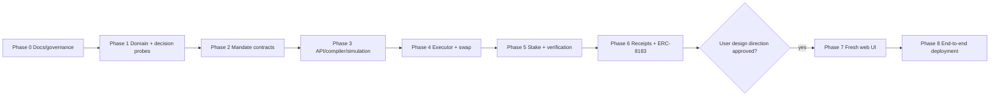

# Perago Build Plan

**Status:** Phase 0 documentation foundation in review  
**Requirement source:** [`PRD.md`](PRD.md)  
**Technical sources:** [`technical/ARCHITECTURE.md`](technical/ARCHITECTURE.md), [`technical/SMART-CONTRACT.md`](technical/SMART-CONTRACT.md), [`technical/ERD.md`](technical/ERD.md), [`technical/INTEGRATION.md`](technical/INTEGRATION.md), [`technical/TECH-STACK.md`](technical/TECH-STACK.md)

## 1. Execution rules

- Phases run in order. A task may start only when its dependencies and prior phase gate pass.
- Each task ID is stable. Change scope by editing its acceptance criteria, not renumbering history.
- `main` receives reviewed PRs. Implementation starts from accepted `dev`; focused branches merge back to `dev` before the next phase gate.
- Commits follow the checkpoints below and remain coherent review units.
- No placeholder integration, fake address, mocked “success,” or unchecked external claim may satisfy an acceptance criterion.
- Exact stable tool/dependency versions are re-verified and pinned at Phase 1 bootstrap.
- Requirement IDs refer to [`PRD.md`](PRD.md). A task is incomplete until every mapped requirement has observable evidence.
- User approval is required at explicit hold points. A contingency may change evidence environment, not silently remove required behavior.

## 2. Phase dependency graph

Phase 1 integration probes may run independently after workspace bootstrap, but Phase 2 implementation waits for all Phase 1 decisions because constructor-pinned addresses/interfaces depend on them.

## 3. Phase 0 — documentation and governance

**Goal:** establish repository policy and an accepted, internally consistent product/technical contract before implementation.

| Task | Requirements | Deliverables | Acceptance criteria | Verification |
| --- | --- | --- | --- | --- |
| `P0-001` Repository governance | PRD-O-004 | `.gitignore`, `AGENTS.md`, `main`, `dev`, remote branch policy | `main` contains only minimal baseline; all docs work is on `dev`; root rules cover sources, invariants, boundaries, commits, verification, secrets, blockers, and UI hold. | Git branch/log/status checks; inspect remote branches. |
| `P0-002` Product and technical specification | PRD-F-001–017, PRD-S-001–013, PRD-O-001–004 | `README.md`, `docs/PRD.md`, all `docs/technical/*.md`, this plan | Every required deliverable exists; states/fields/decisions agree; integration claims have primary sources and status; no unresolved markers defer reachable work. | Link check, terminology/ID/state searches, structured traceability script. |
| `P0-003` Foundation review PR | PRD-O-004 | `dev` → `main` PR | Both branches pushed; coherent commit history; clean worktree; PR describes scope, evidence, sources, risks, and explicit no-code/no-UI boundary. | GitHub PR URL and checks; exact completion report. |

**Commit checkpoints**

1. `chore: initialize Perago repository governance`
2. `docs: establish Perago agent governance`
3. `docs: define Perago product requirements`
4. `docs: specify Perago architecture and data model`
5. `docs: specify mandate contracts and security model`
6. `docs: define BNB integrations and execution adapters`
7. `docs: add stable stack and phased build gates`
8. Documentation consistency fixes, only when they form a real review unit.

**Phase gate:** user accepts the documentation PR. Stop before Phase 1 until explicit approval.

## 4. Phase 1 — typed domain and decision probes

**Dependencies:** accepted Phase 0 PR.  
**Goal:** prove toolchain compatibility and external prerequisites before load-bearing contracts/apps.

### `P1-001` Bootstrap exact stable workspace

- **Requirements:** PRD-O-004.
- **Files/symbols:** root `package.json`, `pnpm-workspace.yaml`, `pnpm-lock.yaml`, `turbo.json`, `tsconfig.base.json`, `biome.json`; minimal package manifests for planned directories; `packages/contracts/foundry.toml`; no UI components.
- **Acceptance:** registry/release checks are recorded in PR; exact non-prerelease versions and Node LTS are pinned; TypeScript/Next/Hono/Drizzle/Viem/Alchemy peer compatibility passes; Foundry/Solidity/OpenZeppelin compile; no speculative dependency.
- **Verification:** frozen install, workspace build/typecheck/lint, one minimal runtime smoke per deployable, `forge build`.
- **Commit:** `chore: bootstrap exact stable monorepo toolchain`.

### `P1-002` Implement canonical domain schemas and hashes

- **Requirements:** PRD-F-002–007, PRD-S-001–003, PRD-S-006, PRD-S-009.
- **Files/symbols:** `packages/sdk/src/domain/{wallet-policy,task-intent,compiled-plan,task-mandate,simulation-result,verification-result,execution-receipt}.ts`; `packages/sdk/src/canonical-json.ts`; `packages/sdk/src/hashes.ts`; `packages/sdk/src/eip712.ts`; exported schemas/types and `hashWalletPolicy`, `hashTaskIntent`, `hashCompiledPlan`, `hashSimulationResult`, `getTaskMandateTypedData`.
- **Acceptance:** unknown fields rejected; token values use bigint-safe representation; closed `SWAP | STAKE` discriminated union; canonical hashes repeat across Node and Solidity fixtures; every signed field from contract spec is present in exact order/type.
- **Verification:** SDK behavior tests for boundaries/hash fixtures; temporary cross-language digest script compared to Foundry fixture.
- **Commit:** `feat(sdk): define canonical mandate domain`.

### `P1-003` Prove account-abstraction path

- **Requirements:** PRD-F-001, PRD-F-017, PRD-S-003, PRD-S-006, PRD-S-008, PRD-S-013.
- **Files/symbols:** `packages/sdk/src/account/modular-account.ts`; `apps/executor/src/probes/account-abstraction.ts`; `deployments/bsc-testnet.account.json` only after values are verified and contain no secrets.
- **Acceptance:** external EOA controls expected Modular Account V2; EntryPoint/factory/account/modules match official source/code hashes; one sponsored and one owner-paid UserOperation land on chain 97; narrow session permits intended MandateExecutor-shaped call and rejects root, upgrade, module-install, unrelated target, excess spend, and expired permission calls; no private/session key is committed/logged.
- **Verification:** disposable-wallet testnet probe with UserOperation/transaction/block evidence and forbidden-call results.
- **Decision:** pin EntryPoint/account/module versions and fallback bundler, or block implementation with exact failed capability.
- **Commit:** `spike(account): validate BSC account abstraction`.

### `P1-004` Resolve protocol deployments

- **Requirements:** PRD-F-009–010, PRD-F-014, PRD-S-005, PRD-S-010, PRD-S-012, PRD-O-003.
- **Files/symbols:** `packages/contracts/script/ProbeIntegrations.s.sol`; `apps/executor/src/probes/integrations.ts`; reviewed `deployments/bsc-testnet.protocols.json` containing source URL/revision, address, code hash, ABI version, proxy/admin/config, validation block/tx.
- **Acceptance:** Pancake V3 router/quoter/factory and one liquid direct pool pass; CAKE Pool deposit/position/withdraw probe resolves `D-002`; APEX kernel/router/policy/token lifecycle probe resolves `D-003`; nonstandard token/approval/admin behavior documented; no stale/unverified address promoted.
- **Verification:** fork reads plus BSC Testnet transactions for smallest safe success/failure/refund scenarios.
- **Decision:** approve documented deployment, select an explicitly sourced replacement, or invoke labeled contingency with user approval.
- **Commit:** `spike(integrations): pin BSC deployment evidence`.

### `P1-005` Freeze contract interfaces and cross-stack fixtures

- **Requirements:** PRD-F-007–008, PRD-S-003–006, PRD-S-013.
- **Files/symbols:** `packages/contracts/src/types/PeragoTypes.sol`; `packages/contracts/src/interfaces/{IPeragoAdapter,IPeragoVerifier}.sol`; `packages/contracts/test/fixtures/TaskMandateFixtures.sol`; SDK ABI/type exports generated from compiled interfaces.
- **Acceptance:** exact EIP-712 digest agrees between SDK and Solidity; interface fields reflect resolved adapters/account path; no implementation or address remains ambiguous.
- **Verification:** Foundry fixture test plus SDK digest test using the same checked-in vector.
- **Commit:** `feat(contracts): freeze mandate interfaces and fixtures`.

**Phase 1 smoke:** from a disposable root wallet, derive/deploy the target smart account, install narrow permission, submit allowed/forbidden UserOperations, quote a real swap, probe stake, and run ERC-8183 create/fund/submit/complete-or-refund lifecycle. Capture evidence; do not proceed on a fabricated fallback.

**Phase gate:** user accepts the resolved AA, staking, ERC-8183, payment-token, and address manifests. All contract decision gates closed.

## 5. Phase 2 — mandate contract and invariant tests

**Dependencies:** Phase 1 manifests/interfaces.  
**Goal:** implement the provider-independent authority and terminal-state boundary.

### `P2-001` Implement account policy and mandate authorization

- **Requirements:** PRD-F-002–003, PRD-F-007–008, PRD-F-013, PRD-S-001–004, PRD-S-006, PRD-S-009, PRD-S-013.
- **Files/symbols:** `packages/contracts/src/MandateExecutor.sol`; `setAccountPolicy`, `authorize`, `invalidateNonces`, `revoke`, `finalizeExpired`, account config/nonce/mandate storage, typed events/errors.
- **Acceptance:** root EIP-712 signer/account/epoch/policy/executor/domain/nonce/expiry/action bindings enforce the spec; only allowed state transitions occur; no session signature is accepted as root.
- **Verification:** focused unit/fuzz tests for every field mutation, owner/policy change, replay, revoke/expiry race, and custom error.
- **Commit:** `feat(contracts): enforce mandate authorization lifecycle`.

### `P2-002` Implement accepted-attempt and atomic failure boundary

- **Requirements:** PRD-F-008, PRD-F-011, PRD-F-015–016, PRD-S-004–005, PRD-S-007.
- **Files/symbols:** `beginExecution`, `perform`, `executeCore`, `finalizeStalledExecution`, receipt storage/events; mock adapters/tokens/verifiers under `packages/contracts/test/mocks/`.
- **Acceptance:** `beginExecution` permanently leaves `AUTHORIZED`; success requires atomic adapter + verifier pass; expected token/protocol/verifier revert records `FAILED` while inner effects roll back; execution timeout fails without retry authority; exact approvals clear and no funds remain.
- **Verification:** unit/fuzz failure matrix including revert data, false returns, malicious callback/reentrancy, cleanup failure, and stalled execution.
- **Commit:** `feat(contracts): make execution one-shot and atomic`.

### `P2-003` Prove contract invariants

- **Requirements:** PRD-S-002–007, PRD-S-010–012.
- **Files/symbols:** `packages/contracts/test/invariant/MandateExecutorInvariant.t.sol`; handler actors/actions covering the 12 invariants in the smart-contract spec.
- **Acceptance:** stateful runs cannot reuse nonce, transition terminal state, exceed spend, change recipient/target, leave approval/balance, produce unverified success, or settle twice.
- **Verification:** deterministic unit suite, high-run fuzz, stateful invariant suite, gas snapshot reviewed for bounded inputs.
- **Commit:** `test(contracts): prove mandate safety invariants`.

**Phase 2 smoke:** local root signs canonical mandate; executor authorizes/begins; smart-account mock performs; success receipt appears. Repeat with verifier failure and replay; observe terminal failure and replay rejection.

**Phase gate:** contract review against `SMART-CONTRACT.md`; all invariants pass; no admin/upgrade/sweep path outside spec.

## 6. Phase 3 — API, compiler, policy, and simulation

**Dependencies:** Phase 2 ABI/fixtures.  
**Goal:** produce a user-signable mandate only from valid intent, active policy, exact action, and fresh simulation.

### `P3-001` Implement persistence and chain projections

- **Requirements:** PRD-F-002, PRD-F-012–016, PRD-S-011, PRD-O-001–003.
- **Files/symbols:** `apps/api/src/db/schema.ts`; migrations matching `ERD.md`; `apps/api/src/db/repositories/*` only where query reuse exists; raw event/projector modules and checkpoint transaction.
- **Acceptance:** database constraints enforce unique active policy, nonce/job/event identities and terminal fields; raw events append once; reorg rollback/replay rebuilds projections; no secret columns.
- **Verification:** migration smoke on clean PostgreSQL, constraint behavior tests, duplicate/reorg projection scenario.
- **Commit:** `feat(api): add constrained lifecycle persistence`.

### `P3-002` Implement wallet authentication and policy lifecycle

- **Requirements:** PRD-F-001–003, PRD-F-017, PRD-S-002, PRD-S-008–009, PRD-S-013.
- **Files/symbols:** `apps/api/src/auth/*`; `apps/api/src/routes/policies.ts`; `apps/api/src/services/policies.ts`; SDK API schemas.
- **Acceptance:** challenge is domain/chain/account/expiry bound and one-use; policy document validates all required rules; activation waits for confirmed smart-account policy/permission events; stale owner/account/policy rejected.
- **Verification:** real signed challenge and BSC Testnet policy activation/revoke smoke; forbidden broad permission rejected.
- **Commit:** `feat(api): enforce wallet policy lifecycle`.

### `P3-003` Implement planner adapter and deterministic compiler

- **Requirements:** PRD-F-004–005, PRD-S-001–003, PRD-F-016.
- **Files/symbols:** `apps/api/src/planner/{provider,prompt}.ts`; `apps/api/src/compiler/{compile,normalize,policy-intersection,reason-codes}.ts`; closed SDK plan schema.
- **Acceptance:** selected model emits only untrusted JSON; unknown/ambiguous output fails; deterministic compiler builds action without model calldata; every Wallet Policy rule yields pass/fail evidence; broader model values reject rather than clamp silently.
- **Verification:** throwaway fixed intent against real provider plus permanent boundary tests for protected asset, protocol, amount/day cap, slippage, recipient, service, expiry, and unknown action.
- **Commit:** `feat(api): compile intents through deterministic policy`.

### `P3-004` Implement exact-action simulation and signing payload

- **Requirements:** PRD-F-006–007, PRD-S-005–006, PRD-S-009–010.
- **Files/symbols:** `apps/api/src/simulation/{balances,swap,stake,user-operation,freshness}.ts`; `apps/api/src/services/mandates.ts`; routes for simulation/signature submission.
- **Acceptance:** result includes required before/expected-after/max/min/protocol/recipient/expiry/risk/block/code hashes; exact adapter and UserOperation path simulates; freshness invalidates on block/quote/policy/account/code/action change; recovered root signature equals canonical digest before queue.
- **Verification:** BSC/fork swap and stake simulation smoke, forced stale cases, SDK/Solidity digest parity.
- **Commit:** `feat(api): simulate and seal task mandates`.

**Phase 3 smoke:** create active policy, submit one natural-language intent, observe typed plan and rule matrix, simulate exact account/action path, sign one mandate, then mutate each critical field and confirm rejection.

**Phase gate:** no executor submission yet; API artifacts independently reproduce the signed digest and simulation evidence.

## 7. Phase 4 — executor and swap

**Dependencies:** Phases 2–3 and validated Pancake deployment.  
**Goal:** execute one bounded PancakeSwap exact-input mandate autonomously and idempotently.

### `P4-001` Implement swap adapter and verifier

- **Requirements:** PRD-F-008–009, PRD-F-011, PRD-S-003–005, PRD-S-007, PRD-S-010.
- **Files/symbols:** `PancakeV3SwapAdapter.sol`, `SwapVerifier.sol`; direct-pool action schema/fixtures/tests.
- **Acceptance:** immutable router/factory/pool/fee; no arbitrary path/multicall; amount/recipient/deadline/minimum bound; direct balance delta verifies output; exact approvals clear; malicious/mismatched inputs fail.
- **Verification:** unit/fuzz + mainnet-fork and chain-97 probe against pinned deployment.
- **Commit:** `feat(contracts): add bounded Pancake swap`.

### `P4-002` Implement executor reconciliation and queue worker

- **Requirements:** PRD-F-008, PRD-F-013, PRD-F-015–017, PRD-S-004, PRD-S-006, PRD-S-013, PRD-O-001–002.
- **Files/symbols:** `apps/executor/src/{worker,lease,reconcile,authorize,begin,perform,user-operation,settle}.ts`; process entry and health/readiness.
- **Acceptance:** every stage reconciles chain/account/UserOperation first; hashes persist before wait; duplicate delivery produces no extra semantic action; dropped/replaced/confirmed states handled; executor/session secret stays in deployment secret store and logs redact it.
- **Verification:** kill/restart between each lifecycle transition, duplicate job injection, dropped UserOperation, expired/revoked mandate, forbidden session call.
- **Commit:** `feat(executor): run idempotent mandate lifecycle`.

### `P4-003` Prove swap end to end

- **Requirements:** PRD-F-006–009, PRD-F-011–013, PRD-S-002–011, PRD-O-001–003.
- **Files/symbols:** deployment manifests/scripts; evidence-producing smoke command under existing executor/scripts path; no separate demo app.
- **Acceptance:** chain-97 or approved labeled fork journey records owner/account, policy, simulation, digest, authorization, begin, UserOperation/tx, output delta, receipt, and replay rejection; excess spend, lower minimum, changed recipient/adapter/selector/action fail.
- **Verification:** actual smoke command and explorer/fork evidence.
- **Commit:** `feat: complete bounded swap execution`.

**Phase gate:** SC-001, SC-003, SC-005 evidence complete except settlement (Phase 6).

## 8. Phase 5 — staking and verification

**Dependencies:** Phase 4; validated staking deployment.  
**Goal:** implement the second distinct closed action and prove its position-based postcondition.

### `P5-001` Implement staking adapter and verifier

- **Requirements:** PRD-F-008, PRD-F-010–011, PRD-S-003–005, PRD-S-007, PRD-S-010.
- **Files/symbols:** `CakeStakeAdapter.sol` (or user-approved renamed verified replacement), `StakeVerifier.sol`, closed stake action and deployment fixture.
- **Acceptance:** one immutable pool/asset, flexible/no-lock action, signed amount/recipient/deadline/minimum position, verifier reads actual share/position delta, exact approval cleanup, unsupported pool/lock/calldata rejected.
- **Verification:** unit/fuzz, fork probe, and live testnet deposit/position/withdraw when deployment supports it.
- **Commit:** `feat(contracts): add verified staking action`.

### `P5-002` Add staking compiler/simulation/executor path

- **Requirements:** PRD-F-004–008, PRD-F-010–013, PRD-F-015–016, PRD-S-001–009.
- **Files/symbols:** closed compiler branch, staking simulation, reason codes, executor action encoder using SDK only.
- **Acceptance:** AI cannot select another staking target; policy/minimum/fee/position fields are explicit; stale or unavailable position reads stop signing; worker uses the same generic lifecycle without protocol-specific bypass.
- **Verification:** natural-language stake smoke, every critical mutation failure, restart/replay scenario.
- **Commit:** `feat: carry stake intent through verification`.

**Phase 5 smoke:** execute a stake mandate and observe signed smart account, exact input, position delta, terminal receipt, replay rejection, and recovery/withdraw evidence. This proves SC-002.

**Phase gate:** both action kinds pass their distinct verifier and failure matrix. If official testnet staking is unavailable, user approves the documented fork/test-vault contingency before the gate.

## 9. Phase 6 — receipts and ERC-8183 settlement

**Dependencies:** successful swap and stake receipts.  
**Goal:** make execution evidence public/rebuildable and link agent payment to deterministic success.

### `P6-001` Implement receipt indexing and public query

- **Requirements:** PRD-F-011–012, PRD-F-016, PRD-S-007–011, PRD-O-001–003.
- **Files/symbols:** receipt event decoder/projector; `apps/api/src/routes/receipts.ts`; SDK public receipt response.
- **Acceptance:** public response exposes commitments, authority-consumed state, UserOperation/transactions/blocks, verifier result/reason, and settlement status; no raw private intent/policy/key material; projection rebuild produces same result.
- **Verification:** drop/rebuild projection from events and compare canonical receipt; orphan/reorg scenario.
- **Commit:** `feat(api): expose verifiable execution receipts`.

### `P6-002` Implement deterministic ERC-8183 evaluator

- **Requirements:** PRD-F-014, PRD-S-007, PRD-S-012.
- **Files/symbols:** `OutcomeEvaluator.sol`; pinned APEX/ERC-8183 interface; settlement tests and deployment script.
- **Acceptance:** only a matching `SUCCEEDED` receipt completes once; failed/revoked/expired/unverified/mismatched/already-settled jobs fail; upstream refund/expiry path remains available; proxy/admin assumptions checked.
- **Verification:** unit/fuzz plus full real/fork complete, reject, and refund lifecycles.
- **Commit:** `feat(contracts): bind payment to verified outcomes`.

### `P6-003` Automate settlement without changing truth

- **Requirements:** PRD-F-014–016, PRD-O-001–003.
- **Files/symbols:** executor settlement/reconciliation path and API projection.
- **Acceptance:** execution success with settlement outage stays success/payment-pending; retry is identical/idempotent; failure never enters settlement; confirmed settlement projects once.
- **Verification:** outage/restart/duplicate settle smoke and mismatched receipt rejection.
- **Commit:** `feat(executor): settle verified ERC-8183 jobs`.

**Phase 6 smoke:** successful swap pays, forced verifier failure withholds payment, expired/rejected job refunds, and public receipt ties every hash/transaction together. This proves SC-001 and SC-004.

**Phase gate:** contract and public evidence can be independently checked from chain plus canonical offchain documents.

## 10. Phase 7 — fresh web client

**Hard hold:** do not start until the user provides and approves Perago's design direction after the documentation/implementation foundations. Do not reuse reference UI, flows, styles, assets, routes, or copy.

### `P7-001` Translate approved design direction into accessible shell

- **Requirements:** PRD-F-001, PRD-O-002–004.
- **Files/symbols:** `apps/web` routes/components determined from approved direction; no precommitted screen specification here.
- **Acceptance:** implementation matches supplied direction, responsive/keyboard/focus/contrast basics pass, unsupported chain/account/error states are real.
- **Verification:** actual browser visual and interaction review at target viewports.
- **Commit:** defined after approved design scope.

### `P7-002` Implement policy, mandate, and receipt journey

- **Requirements:** PRD-F-001–017, PRD-S-001, PRD-S-008–009, PRD-S-013.
- **Files/symbols:** approved web surfaces using SDK/API/native Wagmi hooks.
- **Acceptance:** deterministic facts—not model prose—drive signing display; root signature and UserOperation prompts show exact account/limits; pending/terminal/failure/revoke/expiry/settlement states reconcile from API/chain; no secret enters client logs.
- **Verification:** browser journey with wallet rejection, wrong chain, stale simulation, successful swap/stake, failed verification, replay, revoke, and provider outage.
- **Commit:** coherent journey checkpoints after design approval.

**Phase 7 gate:** user visual/product review and browser evidence. No design invention is authorized by this plan.

## 11. Phase 8 — end-to-end demo and deployment

**Dependencies:** all prior gates.  
**Goal:** deploy reproducibly and prove the complete judge story.

### `P8-001` Deploy reviewed environment

- **Requirements:** PRD-O-001–004, PRD-S-008, PRD-S-010–011.
- **Files/symbols:** reviewed environment examples, deployment manifests/scripts, CI and platform config; never secrets/generated provider state.
- **Acceptance:** fresh deployment from docs/committed config; exact versions; contracts verified; addresses/code hashes/admin state recorded; health/readiness and rollback documented.
- **Verification:** clean-environment deploy and smoke; secret scan; manifest-to-chain check.
- **Commit:** `chore: deploy reproducible Perago demo`.

### `P8-002` Run judge-verifiable scenario matrix

- **Requirements:** every PRD requirement; SC-001–007.
- **Files/symbols:** concise operator runbook/evidence index in the existing docs only if the user requests documentation update; no giant historical diary.
- **Acceptance:** swap success + payment; stake success; excess amount/lower minimum/changed recipient/selector/replay/expiry/revoke rejection; forced verifier failure + withheld payment; restart/duplicate delivery; explorer-linked evidence; honest fork/test labels.
- **Verification:** run the deployed product, capture exact URLs/transactions/blocks/results, and independently recompute at least one receipt commitment.
- **Commit:** `chore: verify end-to-end hackathon demo`.

### `P8-003` Final scope and claim audit

- **Requirements:** PRD-O-004, SC-006–007.
- **Acceptance:** README/submission claims match observed evidence; no mock/old-product/stale address/secret/build state; setup works from fresh checkout; contingency labels visible; worktree clean.
- **Verification:** source/link/secret/terminology searches, frozen install/build, targeted contract/app checks, actual browser/worker demo.

**Phase gate:** explicit release/submission approval.

## 12. Requirement traceability

| Requirement | Build tasks |
| --- | --- |
| PRD-F-001 | P1-003, P3-002, P7-001–002 |
| PRD-F-002–003 | P1-002, P2-001, P3-002 |
| PRD-F-004–005 | P1-002, P3-003, P5-002 |
| PRD-F-006 | P3-004, P4-003, P5-002 |
| PRD-F-007 | P1-002, P1-005, P2-001, P3-004 |
| PRD-F-008 | P2-001–002, P4-001–002, P5-001–002 |
| PRD-F-009 | P1-004, P4-001, P4-003 |
| PRD-F-010 | P1-004, P5-001–002 |
| PRD-F-011 | P2-002–003, P4-001, P5-001, P6-001 |
| PRD-F-012 | P3-001, P6-001 |
| PRD-F-013 | P2-001, P4-002–003 |
| PRD-F-014 | P1-004, P6-002–003 |
| PRD-F-015–016 | P2-002, P3-001/003, P4-002, P6-001/003 |
| PRD-F-017 | P1-003, P3-002, P4-002 |
| PRD-S-001–002 | P1-002, P2-001, P3-002–003 |
| PRD-S-003–006 | P1-002–005, P2-001–003, P4-001–003, P5-001–002 |
| PRD-S-007 | P2-002–003, P4-001, P5-001, P6-001–003 |
| PRD-S-008 | P1-003, P3-002, P4-002, P7-002, P8-001 |
| PRD-S-009 | P1-002, P2-001, P3-002/004, P7-002 |
| PRD-S-010 | P1-004–005, P2-003, P4-001, P5-001, P8-001 |
| PRD-S-011 | P3-001, P6-001, P8-001 |
| PRD-S-012 | P1-004, P2-003, P6-002–003 |
| PRD-S-013 | P1-003, P2-001, P3-002, P4-002, P7-002 |
| PRD-O-001–003 | P3-001, P4-002–003, P6-001/003, P8-001–002 |
| PRD-O-004 | P0-001–003, P1-001, every phase gate, P8-003 |

Every requirement maps to at least one implementation task and an observable acceptance/verification statement. Phase 8 runs the complete matrix rather than replacing task-level proof.

## 13. Scope cuts and contingencies

### Cuts already applied

No LP, lending/borrowing, leverage, bridge, arbitrary calldata, marketplace, ERC-8004, governance/token, multi-agent committee, generic router, protocol breadth, Redis/broker, upgradeable Perago contracts, or speculative UI/design work.

### Safe contingencies

| Failure | Contingency that preserves claims |
| --- | --- |
| CAKE Pool testnet deployment is dead | User-approved pinned BSC mainnet fork; if presentation requires testnet, explicitly labeled minimal Perago test vault proves verifier mechanics but not Pancake staking integration. |
| Pancake testnet pool lacks liquidity | Seed a clearly identified test pool or use pinned mainnet fork; never present mock liquidity as public. |
| APEX deployment cannot accept deterministic evaluator | Deploy/pin a separate standards-compatible test instance or mark settlement blocked; never use optimistic silence as Perago verification. |
| Alchemy sponsorship unavailable | Submit the unchanged standard UserOperation owner-funded through validated bundler. |
| Alchemy bundler unavailable | Use a validated compatible bundler for the same EntryPoint/account; otherwise pause. |
| AI provider unavailable | Disable new compilation and preserve deterministic read/status/revoke paths; do not invent fallback plans. |
| UI direction delayed | Keep Phase 7 blocked and demonstrate API/CLI/chain flows only with user approval; do not invent design. |

### Non-negotiable scope

The bounded swap, bounded stake, one-use terminal authority, deterministic verification, public receipt, and outcome-linked payment are the accepted MVP. Schedule pressure does not silently remove them. Any reduction requires explicit user approval and corresponding PRD/build-plan change before implementation.
