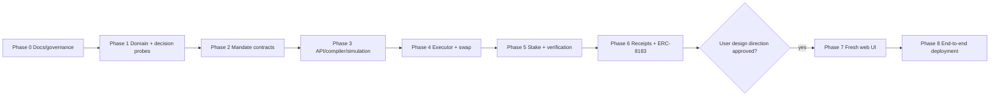

# Perago Build Plan

**Status:** Phase 1 accepted on 2026-09-19 and open in [PR #5](https://github.com/Dylansius11/perago/pull/5); Phases 2–5 and the fork-first Phase 6 gate are complete on `dev`. By explicit user decision on 2026-09-23, `P4-001` and `P5-001` were built ahead of order and the production MandateExecutor deployed on chain 97. `P4-003` and `P5-002` have fork and live chain-97 execution evidence on the labelled `testnet-demo` executor (`SC-D-006`). `P6-001` closed on 2026-09-24 with fork evidence for the public receipt and local PostgreSQL replay/reorg proof. `P6-002` closed on 2026-09-27 with deterministic evaluator unit/fuzz and APEX fork evidence, plus live read-only proxy preflight. `P6-003` closed with the bound production executor, fork-only automated payment/refund evidence, and local PostgreSQL reconciliation proof. No evaluator deployment, hosted API, Supabase migration, or live Perago payment is claimed. `P7-000`/`P7-001` were authorized and completed out of order (2026-09-19/20); later phases remain gated.
**Requirement source:** [`PRD.md`](PRD.md)
**Technical sources:** [`technical/ARCHITECTURE.md`](technical/ARCHITECTURE.md), [`technical/SMART-CONTRACT.md`](technical/SMART-CONTRACT.md), [`technical/ERD.md`](technical/ERD.md), [`technical/INTEGRATION.md`](technical/INTEGRATION.md), [`technical/TECH-STACK.md`](technical/TECH-STACK.md)

## Progress tracker

Check a task only after its acceptance criteria and verification evidence pass. A completed phase still requires its phase gate.

- [x] **Phase 0 — documentation and governance**
  - [x] `P0-001` Repository governance
  - [x] `P0-002` Product and technical specification
  - [x] `P0-003` Foundation review PR
- [x] **Phase 1 — typed domain and decision probes**
  - [x] `P1-001` Bootstrap exact stable workspace
  - [x] `P1-002` Implement canonical domain schemas and hashes
  - [x] `P1-003` Prove account-abstraction path
  - [x] `P1-004` Resolve protocol deployments
  - [x] `P1-005` Freeze contract interfaces and cross-stack fixtures
- [x] **Phase 2 — mandate contract and invariant tests**
  - [x] `P2-001` Implement account policy and mandate authorization
  - [x] `P2-002` Implement accepted-attempt and atomic failure boundary
  - [x] `P2-003` Prove contract invariants
- [x] **Phase 3 — API, compiler, policy, and simulation**
  - [x] `P3-001` Implement persistence and chain projections
  - [x] `P3-002` Implement wallet authentication and policy lifecycle
  - [x] `P3-003` Implement planner adapter and deterministic compiler
  - [x] `P3-004` Implement exact-action simulation and signing payload
- [x] **Phase 4 — executor and swap**
  - [x] `P4-001` Implement swap adapter and verifier
  - [x] `P4-002` Implement executor reconciliation and queue worker
  - [x] `P4-003` Prove swap end to end
- [x] **Phase 5 — staking and verification**
  - [x] `P5-001` Implement staking adapter and verifier
  - [x] `P5-002` Add staking compiler/simulation/executor path
- [x] **Phase 6 — receipts and ERC-8183 settlement (fork-first gate)**
  - [x] `P6-001` Implement receipt indexing and public query
  - [x] `P6-002` Implement deterministic ERC-8183 evaluator
  - [x] `P6-003` Automate settlement without changing truth
- [ ] **Phase 7 — fresh web client**
  - [x] `P7-000` Scaffold the web toolchain without design
  - [x] `P7-001` Translate approved design direction into accessible shell
  - [ ] `P7-002` Implement policy, mandate, and receipt journey
  - [x] `P7-003` Add a rate-limited testnet tBNB faucet
- [ ] **Phase 8 — end-to-end demo and deployment**
  - [ ] `P8-001` Deploy reviewed environment
  - [ ] `P8-002` Run judge-verifiable scenario matrix
  - [ ] `P8-003` Final scope and claim audit

## 1. Execution rules

- Phases run in order. A task may start only when its dependencies and prior phase gate pass.
- Each task ID is stable. Change scope by editing its acceptance criteria, not renumbering history.
- `main` receives reviewed PRs using merge commits; never squash or rebase-merge. Implementation starts from accepted `dev`; focused branches merge back to `dev` before the next phase gate.
- Commits follow the checkpoints below and remain coherent review units.
- No placeholder integration, fake address, mocked “success,” or unchecked external claim may satisfy an acceptance criterion.
- Exact stable tool/dependency versions are re-verified and pinned at Phase 1 bootstrap.
- Requirement IDs refer to [`PRD.md`](PRD.md). A task is incomplete until every mapped requirement has observable evidence.
- User approval is required at explicit hold points. A contingency may change evidence environment, not silently remove required behavior.

## 2. Phase dependency graph

Phase 1 integration probes may run independently after workspace bootstrap, but Phase 2 implementation waits for all Phase 1 decisions because constructor-pinned addresses/interfaces depend on them.

## 3. Phase 0 — documentation and governance

**Goal:** establish repository policy and an accepted, internally consistent product/technical contract before implementation.

| Task | Requirements | Deliverables | Acceptance criteria | Verification |
| --- | --- | --- | --- | --- |
| `P0-001` Repository governance | PRD-O-004 | `.gitignore`, `AGENTS.md`, `main`, `dev`, remote branch policy | `main` contains only minimal baseline; all docs work is on `dev`; root rules cover sources, invariants, boundaries, commits, verification, secrets, blockers, and UI hold. | Git branch/log/status checks; inspect remote branches. |
| `P0-002` Product and technical specification | PRD-F-001–017, PRD-S-001–013, PRD-O-001–004 | `README.md`, `docs/PRD.md`, all `docs/technical/*.md`, this plan | Every required deliverable exists; states/fields/decisions agree; integration claims have primary sources and status; no unresolved markers defer reachable work. | Link check, terminology/ID/state searches, structured traceability script. |
| `P0-003` Foundation review PR | PRD-O-004 | `dev` → `main` PR | Both branches pushed; coherent commit history; clean worktree; PR describes scope, evidence, sources, risks, and explicit no-code/no-UI boundary. | GitHub PR URL and checks; exact completion report. |

**Commit checkpoints**

1. `chore: initialize Perago repository governance`
2. `docs: establish Perago agent governance`
3. `docs: define Perago product requirements`
4. `docs: specify Perago architecture and data model`
5. `docs: specify mandate contracts and security model`
6. `docs: define BNB integrations and execution adapters`
7. `docs: add stable stack and phased build gates`
8. Documentation consistency fixes, only when they form a real review unit.

**Phase gate:** user accepts the documentation PR. Stop before Phase 1 until explicit approval.

## 4. Phase 1 — typed domain and decision probes

**Dependencies:** accepted Phase 0 PR.
**Goal:** prove toolchain compatibility and external prerequisites before load-bearing contracts/apps.

### Execution record — updated 2026-09-28

This record tracks live work without marking a task complete before all of its acceptance criteria pass.

| Task | Current evidence | Remaining acceptance or blocker |
| --- | --- | --- |
| `P1-002` | Complete. The frozen `TaskMandate` type string is byte-identical across four independent sources: this specification, the Solidity struct in `packages/contracts/src/types/PeragoTypes.sol`, the `TASK_MANDATE_TYPEHASH` literal in `packages/contracts/test/fixtures/TaskMandateFixtures.sol`, and both the type string and the typed-data array in `packages/sdk/src/eip712.ts` (22 fields). SDK and Foundry fixtures agree on digest `0x9b204a82d741df2398ef74a699cc6a9b5cc4dae63aac247b0d69c29e4f206574`; SDK tests cover unknown-field rejection, bigint-safe uint256 strings, and the closed `SWAP \| STAKE` union. | None. |
| `P1-003` | Complete. A disposable root owner `0x2E42E0FB693765715014934282b9A7d3cF0c3818` controls the derived account `0x2863167c8653b9369Ef51De203742A3429AC57E2` (deployed in `0x3182afdc31878abd6a9f0639e1533fd4602368ee766ba0689a0530a1b51eec05`). `apps/executor/src/probes/account-live.ts` re-verifies every manifest code hash against live code, then submits through the Alchemy bundler with fresh permission slots per run: owner-paid session install `0xf33b27b978f0f3b676c3aa66d9aba8a2fb07393c8581a77d01db7e9a706edb31` (block `131790009`); **sponsored** session call `0xeb5a84b01278515b6dc3f1eacf6c952098566ae285e34393d9af3cc5690efeb5` (block `131790024`, `actualGasCost` `0`, `0.0002 tBNB` wrapped by the session signer, not the owner); expired-session install `0xd11152c17edda28c91161b193d21a534ac1df60ce2215ebd1ad3206d79c3f3ca`; session revocation `0x276da0f5ca84477e0e30080c5329969fd0b5b710db6f2375f01f9405ee7f4397`; expired-session cleanup `0x36d2fa546c43c6d3060a356ad358bfcf224716eee20001379315976425f4e838`. All seven forbidden shapes are rejected on chain 97 with decoded reasons: unrelated target and unallowlisted selector (`AllowlistModule` revert `0x4db96e31`), module install and revoked session (`ValidationFunctionMissing` `0xcf7b49f6`), account self-call (`SelfCallRecursionDepthExceeded` `0x54ff929d`), spend above limit (`NativeTokenLimitModule` revert `0x74a1a72c`), and expired permission (time-range validation). Evidence is pinned in `deployments/bsc-testnet.account.json`. | None. |
| `P1-004` | Complete. `deployments/bsc-testnet.protocols.json` pins thirteen addresses with live code hashes and ERC-1967 implementations; `pnpm --filter @perago/executor probe:integrations` re-reads every one and fails on drift, and also proves router/quoter/factory agreement, four direct CAKE/WBNB pools (deepest: fee `500`, `0xeaf78e3AA2C19dF9495318Cd9EA2aD83Be7D5015`), a live quote, CAKE Pool wiring, and kernel state. `pnpm --filter @perago/executor probe:protocol-live` then executed the full matrix on chain 97 with **zero** owner-paid gas (every UserOperation sponsored): swap `0x6329318347d05b355d12ed4ec537772fe864f82080abf954501e6421590fd85b`, stake `0x399b362f7dbce4cd1fdd80c27d3a036d46e0af5a6bfd53d1a08118c8d4333059`, unstake `0x69c8d0696f39f9fcb937770e335b6f2739696bbd0f571a581ecb50ed3c892838` (returned `31743379200592744851574047295` of `31775154354917688259102245144` wei, i.e. the documented 0.1% early-withdrawal fee), payment-token funding `0x6a832f869a164490f63866b28e356444a509c44e309d03cb24f5fd7ed5c63729`. ERC-8183 job `1258` ran `Open → Funded → Submitted → Completed` (`create` `0x61ee4d4098cb5a219348a43cf56a98d4063b3a173aa0240d4702238a7167946e`, `fund` `0xa3428caad9c05b32f29d54fb5192290bd6fba666b3da007c9de03dc9eb212480`, provider `submit` `0x24e9842e332f17edf0b91afdd50ef37e5b2a442443b0f12bd310c2a65994d6cb`, `complete` `0x57264534623660086dc3b2d01c427e90ccdb5c4f8ddcd0e83e2fe692df566b63`); job `1259` was refunded by evaluator rejection (`0x149ab35670880f2870acb829284333424e07c84ee3323cde0303f573a11a3171`); job `1260` was refunded by permissionless expiry (`0x9470fd0087f6ad8a04d7dc0069f798ee5774b4eee1e99ba66e6bc0793c234fd7`). Full report: [`evidence/bsc-testnet.protocol-live.json`](evidence/bsc-testnet.protocol-live.json). `D-002` and `D-003` are resolved in [`technical/INTEGRATION.md`](technical/INTEGRATION.md). | None. |
| `P1-005` | Complete. `PeragoTypes`, the adapter/verifier interfaces, the new `IACPHook` mirror, and `PeragoAcpHook` compile and pass `forge test` (5 tests). `packages/sdk/scripts/sync-abis.mjs` regenerates `packages/sdk/src/abi/perago-contracts.ts` from the Foundry artifacts, and the SDK exports `peragoAdapterAbi`, `peragoVerifierAbi`, and `peragoAcpHookAbi`. `packages/sdk/test/abi.test.ts` derives the 22-field mandate tuple from `taskMandateTypes` and proves the compiled `validate`, `execute`, and `measure` selectors match it, and that the hook answers interface id `0x7ff6bc9e`; 27 SDK tests pass. Every address Perago calls is pinned and verified in `deployments/bsc-testnet.account.json` and `deployments/bsc-testnet.protocols.json`. | None. |
| `P2-001` | Complete. `packages/contracts/src/MandateExecutor.sol` implements `setAccountPolicy`, `invalidateNonces`, `authorize`, `revoke`, and `finalizeExpired` over the frozen storage layout, with adapter/verifier pairs, `executionWindow`, and the `allowUnboundCommerceJobs` flag (local, fork, or the labelled `testnet-demo` deployment of `SC-D-006`; never production) pinned as constructor immutables. `forge test --match-contract MandateExecutorAuthorization` passes 56 tests (51 deterministic unit tests, of which 4 cover the constructor pinning guards, plus 5 fuzz properties at 256 runs each), including: owner-epoch monotonicity with a strictly greater epoch for a new owner; policy replacement and owner rotation invalidating already-signed mandates (`PolicyHashMismatch`, `RootOwnerMismatch`); `WrongExecutor`, `WrongChain`, `ExpiredMandate`, `UnsupportedAdapter`, `WrongSelector`, `InvalidTokenPair`, `AmountOutOfBounds`, and `InvalidMandateField` rejections; a session-key signature rejected as root and a high-`s` malleable signature rejected (`InvalidRootSignature`); a mandate signed for a sibling deployment rejected by the domain separator; nonce replay, same-nonce reuse, commerce-job reuse, and `invalidateNonces` blocking authorization; terminal immutability across revoke/expiry races; and `hashMandate` equal to the frozen cross-stack fixture digest. | None for `P2-001`. `beginExecution`, `perform`, `executeCore`, and `finalizeStalledExecution` are `P2-002`; the deployed `executionWindow` value stays open as `SC-D-005` until BSC inclusion is measured. |
| `P2-002` | Complete. `beginExecution`, `perform`, `executeCore`, and `finalizeStalledExecution` implement the accepted-attempt and atomic failure boundaries: the success receipt is written **inside** the verified self-call, the outer frame only records `FAILED` with a bounded revert commitment (`keccak256(abi.encode(size, first 256 bytes))`), and the subcall gas is capped at `gasleft() - 60_000` so a gas-burning adapter cannot starve the record. `forge test` passes 110 tests (49 new: 45 deterministic, 4 fuzz at 256 runs), covering exact-allowance spend and cleanup, executor-measured input spend, refund of unspent and handed-back input, stranded output (`RecipientMismatch`), adapter inflation and unbound verifier evidence (`VerificationFailed`, `PostconditionHashMismatch`), adapter and verifier reverts, oversized revert data, reentrancy into `perform` and `revoke`, total gas burn, a fee-on-transfer input token, stalled finalization, and every second-attempt rejection. Seven targeted mutations of the guards were each caught by at least one test; the survivor found on the first pass (an unbounded subcall) is now covered by a gas-sized test. | None. |
| `P2-003` | Complete. `MandateExecutorInvariantTest` drives 17 explicit honest/adversarial actions through root owner, smart account, executor, attacker, pinned adapters, and pinned verifiers; 13 named properties cover the 12 specification invariants plus rejection of unnamed callers. A reachability witness enters `SUCCEEDED`, `FAILED`, `REVOKED`, and `EXPIRED`, preventing vacuous green runs. `forge test` passes 113 tests; authorization and execution fuzz suites pass at 10,000 runs per fuzz property; the stateful suite passes 1,000 runs × 100 calls (100,000 calls, zero handler reverts). Mutation audit caught nonce, commerce-job, terminal-state, allowance, minimum-output, refund, root-signature, executor-proof, and caller-authorization faults; removing the duplicate-hash check is an equivalent mutant because the consumed nonce rejects the same second authorization first. `forge snapshot` records 125 bounded-path entries in `packages/contracts/.gas-snapshot`. A temporary local Forge script deployed the contracts and observed a `SUCCEEDED` receipt, verifier-driven terminal `FAILED`, and replay rejection; the script was removed after the smoke. Evidence: [`evidence/p2-003-local.json`](evidence/p2-003-local.json). Actual ERC-8183 evaluator settlement remains `P6-002`/`P6-003`, so this task proves the one-job/one-receipt boundary and does not claim a deployed settlement path. | None. |
| `P3-001` | Complete locally in commit `b43051f`. `apps/api/src/db/schema.ts` and `apps/api/drizzle/0000_constrained_lifecycle.sql` implement the eleven ERD tables with database-enforced active-policy, mandate nonce, commerce-job, raw-event, terminal-field, byte-width, lease, and immutable-evidence boundaries. `applyChainEventBatch` commits confirmed raw events, checkpoint movement, duplicate suppression, reorg orphaning, and mandate/receipt replay in one PostgreSQL transaction. On a clean `postgres:16.10-alpine` database, `pnpm --filter @perago/api test:db` passes two behavior tests covering constraints, forbidden secret columns, append-only payloads, duplicate delivery, and a block-11 fork that replaces `EXECUTING` with canonical `REVOKED`; `pnpm run check` also passes. Evidence: [`evidence/p3-001-local.json`](evidence/p3-001-local.json). | Hosted PostgreSQL 18.6, live RPC ingestion, and production confirmation-depth measurement remain deployment/integration work; none is claimed by this local task. |
| `P3-002` | Complete. Commits `2ad1d5f`, `9cd9ab7`, `92faadf`, `acb4d75`, `d7f2778`, `d631d18`, and `cbc9b0a` implement strict SDK wallet/policy schemas, one-use signed challenge authentication, opaque hashed sessions, authenticated policy routes, atomic account-policy transition encoding, deterministic Viem confirmation against the same exact EntryPoint UserOperation calldata/event hash, atomic database evidence constraints, and locked wallet identity/epoch revalidation. MetaMask-compatible EIP-712 output explicitly carries `EIP712Domain` without changing the contract digest. The user-controlled root `0x712683F374Cd524F6336E87D577Fc39d1102930A` deployed account `0x17fcCe2B0C0cc44c4F88C6C09b6364a766Ee7944` and completed owner-paid BSC Testnet activation (`0x2b255ce76af5e41168e2b9cf4d26d2b5d44d6547c6976b485aa284f252c17ebc`, block `132504008`) and revocation (`0xcd538ff065c6a36fc68aa2f12dbd9440f0901c97e661f66d39e4762bbb423f03`, block `132504589`). Each transition used one root UserOperation whose account batch changed the permission and the policy atomically. Evidence: [`evidence/p3-002-local.json`](evidence/p3-002-local.json), [`evidence/bsc-testnet.p3-policy-live.json`](evidence/bsc-testnet.p3-policy-live.json), and probe-only deployment manifest [`../deployments/bsc-testnet.p3-policy-probe.json`](../deployments/bsc-testnet.p3-policy-probe.json). | None for `P3-002`. The deployed MandateExecutor is policy-probe-only: its mock adapters/verifiers cannot satisfy P4/P5, its production `executionWindow` remains `SC-D-005`, sponsorship was not used for these transitions, and hosted PostgreSQL remains deployment work. |
| `P3-003` | Complete. Commits `8d480ec`, `5283a72`, and `35cd176`. The planner is Groq `openai/gpt-oss-120b` through `groq-sdk` `1.6.0` with strict `json_schema` output; it sees the goal, the smart-account address, and the manifest-pinned vocabulary, never policy limits. `packages/sdk` owns the closed `PlanCandidate`, the pre-quote `CompiledPlan`, the ordered 13-rule `PolicyDecision`, stable reason codes with sentences, and the salted `TaskIntent`. `apps/api/src/compiler` normalizes without rounding, intersects every Wallet Policy rule, and builds the plan from catalog and policy values only. `POST /tasks` is idempotent per wallet request id, encrypts the goal, persists passing and rejected decisions, and returns planning failures to `DRAFT`; migration `0002` enforces task transitions, the active-policy guard, and immutable compilation evidence. 23 compiler boundary tests, 10 database tests, and `pnpm run check` pass ([`evidence/p3-003-local.json`](evidence/p3-003-local.json)). The real-provider matrix of ten fixed intents rejected every broader value without clamping, asked for clarification on transfer, relative-amount, and injected-calldata goals, and produced the same plan hash on three identical requests; one intent compiled through HTTP and PostgreSQL ([`evidence/p3-003-planner-live.json`](evidence/p3-003-planner-live.json)). | None. `P3-004` must re-run policy intersection, including the rolling daily cap, when it accepts a signature, and derives `minAmountOut`/`minPositionOut` and the chain-time deadline from the quote rather than the plan. |
| `P3-004` | Complete. Commits `62cdeef` (SDK plus harness) and `b96c122` (API), plus the smoke and documentation commit. It was reordered by user decision so that `P4-001`/`P5-001` and the production deployment ([`../deployments/bsc-testnet.perago.json`](../deployments/bsc-testnet.perago.json)) came first. **Simulation:** one pinned-block `eth_call` installs the never-deployed `MandateSimulationHarness` at the account address and overrides only the one MandateExecutor record, then runs the account's exact `approve` → `perform` path through the deployed executor, adapter, verifier, and protocol (`INTEGRATION.md` §11). `test/fork/MandateSimulationHarness.fork.t.sol` (4/4) proves that it predicts the real `authorize` → `beginExecution` → `perform` path for swap and stake: equal spend, outcome, and `verificationHash`, failing closed on a layout miss. **Signing:** `SimulationResult` enforces action/spend/minimum/recipient/postcondition/binding consistency (52 SDK tests; a mutation audit caught every guard). The mandate derives from the result alone; SDK/Solidity digest parity is 2/2 for `TaskMandate` and `ExecutionProof`. The API refuses a signing payload when the executor requires an ERC-8183 job (`COMMERCE_BINDING_REQUIRED`, user decision Option 1), and freshness is rechecked at both prepare and signature. Migration `0003` makes the database refuse a signable task without a passing latest simulation, a mandate without that evidence, and a non-fresh queue row. **Evidence:** API typecheck, 49 unit tests, and `test:db` 10/10 on clean `postgres:16.10-alpine`. The labelled **fork** smoke `pnpm --filter @perago/api smoke:phase3` (7/7, [`evidence/bsc-testnet.fork.phase3-smoke.json`](evidence/bsc-testnet.fork.phase3-smoke.json), fork of chain 97 at block `132837387`) ran over the production adapters and a fork-only unbound-job MandateExecutor. It covers policy activation, a real Groq intent, typed plan and rule matrix, exact swap and stake simulation, one signed and queued mandate with idempotent replay, and all 24 signed-field, domain, and signer mutations rejected by both the API (`SIGNATURE_INVALID`) and an `authorize` `eth_call`. Forced staleness returns `STALE_QUOTE`, `STALE_BLOCK`, `STALE_POLICY`, `STALE_NONCE`, `STALE_CODE`, `STALE_ACTION`, and `STALE_ACCOUNT`, and the daily cap is enforced at signing. The exact stake path also runs read-only against the **production** executor on chain 97 itself. | None. Live execution on the production executor waits for Phase 6 ERC-8183 job creation. |
| `P4-001` | Complete, pulled forward by the user decision above. `PancakeV3SwapAdapter` and `SwapVerifier` are implemented against `SMART-CONTRACT.md` §6. One 22-test suite (one fuzz property at 256 runs) runs unchanged on two forks via `pnpm --filter @perago/contracts test:fork`: chain 97 at block `132658000` against the fee-500 WBNB/CAKE pool, and **BSC mainnet** at block `123518579` against real liquidity in the deepest direct WBNB/CAKE pool (fee `2500`, `0x133B3D95bAD5405d14d53473671200e9342896BF`), with mainnet addresses from the official PancakeSwap page and tokens read from the router and MasterChefV3 ([`../deployments/bsc-mainnet.fork.json`](../deployments/bsc-mainnet.fork.json)). It covers pinning, every field mutation, a zero minimum, non-canonical bytes, deadline and minimum reverts, a partial-fill witness, donation resistance, verifier pairing/action/postcondition/context/minimum/spend rejections, a `SUCCEEDED` receipt through `MandateExecutor` whose `verificationHash` is recomputed, and a terminal `FAILED` that moves nothing. A mutation audit removed each of the 22 guards and every mutant failed a named test. `test/ActionFixtures.t.sol` and `packages/sdk/test/action-fixture.test.ts` pin the same action and postcondition hashes. Deployed on chain 97 by `DeployPerago.s.sol` (adapter `0xB9FaeB0Bb29401a1308e0C1287913D94b18EC635`, verifier `0xBeeAeEa965B70117dd2F05E227413d04D5ee53a5`); `pnpm --filter @perago/executor probe:adapters-live` re-verified code hashes, confirmed the deployed `validate` reads the SDK's bytes as the same hash, rejected a changed recipient (`RecipientMismatch`) and an unreachable minimum (`Too little received`), swapped 0.002 WBNB in tx `0x37ed4fdfee36c3945f0dd2337bbd4d385892c9cdbcbc5f46cee17716415a381e` (block `132663244`) for exactly the quoted output, and the verifier measured the same delta at that block with zero leftover allowance or balance ([evidence](evidence/bsc-testnet.adapters-live.json)). | None. |
| `P4-002` | Complete in commits `b9484ba`, `5c85d9a`, `6d7bb50`, and `7875e21`. The API owns authenticated leases and derives status from a forward-only, chunked `finalized` log scan cross-checked against `mandateRecord`; migration `0004` enforces one pending transaction, monotonic evidence, attempt accounting, and immutable terminal/rejected rows. The worker reconciles before every stage, persists the hash and exact signed bytes before broadcast, rebroadcasts dropped bytes unchanged, retires only finalized nonce replacements, self-submits the perform-only UserOperation, and resumes expired leases after crashes. The eight-test chain-97-fork smoke at block `132836118` ([evidence](evidence/bsc-testnet.fork.phase4-executor-smoke.json)) proves duplicate delivery, dropped AUTHORIZE/PERFORM, replaced BEGIN, revocation, pre-authorization rejection, expiry, stalled finalization, SIGKILL restart, four forbidden session calls, and redaction across 99 executor log lines; no write reached chain 97. Executor tests pass 29/29, DB integration tests 16/16, and all 35 targeted guard mutations are killed. | None. |
| `P4-003` | Complete in commits `9e293a0` (demo executor, `SC-D-006`), `24c17a3` (manifest-path loader and shared executor runner), `2847584` (journey smoke), `ccde66f` (live evidence), and the closing commit. `pnpm --filter @perago/api smoke:phase4-swap` (fork) and `smoke:phase4-swap:testnet` (live chain 97) run one natural-language swap through the real API, PostgreSQL, Groq planner, `createViemPolicyChainVerifier`, and executor process. The target is the labelled `testnet-demo` MandateExecutor `0x5587…1b7C`: the same source over the production pairs with the 600 s window, with unbound jobs allowed. **Live chain 97** ([evidence](evidence/bsc-testnet.phase4-swap-journey.json)), with owner `0x2E42…3818`, account `0x2863…57E2`, and executor `0x5ad8…5A18`: policy activation `0x00eb7519…ff11`; simulation at block `132862940`; digest `0x49ebb8c7…a00a`, equal across the API, the SDK, and `hashMandate`; an exact root approval; authorize `0xf673c21a…4278`; begin `0x71076311…626f`; and perform `handleOps` `0xa1a60d2f…e64b` (UserOperation `0x20b3f8f9…686f`, success), finalized in block `132863046`. The swap spent 0.01 WBNB (exactly `maxInput`) and received 367910598556753054236226900571 CAKE against a minimum of 364231492571185523693864631565, leaving allowance 0 and no residue in MandateExecutor. The receipt `verificationHash` `0x0bda974f…8a92` equals the onchain record, and the transaction was re-read independently from live RPC. **Refusals, identical on the fork and live:** policy (`PER_TASK_CAP`, `RECIPIENT`; simulation refused); API (six tampered root signatures, each `SIGNATURE_INVALID`); `authorize` (`InvalidRootSignature` for raised spend, a lowered minimum, a changed recipient, the stake adapter, and a changed action hash; `UnsupportedAdapter`; `WrongSelector`; `WrongExecutor`); `perform` while EXECUTING (the control returns `SUCCEEDED`; a tampered mandate gives `InvalidTransition`; a raised `amountIn`, lowered minimum, or changed recipient or fee in the action gives `ActionHashMismatch`; a foreign proof gives `InvalidExecutorProof`); session (`revoke`, another MandateExecutor, and `WBNB.transfer` give `FailedOpWithRevert(AA23)`; an action changed after signing gives `AA24`). **Replay:** the exact authorize, begin, and perform inputs give `NonceAlreadyUsed`, `InvalidTransition`, and `AA25`; a fresh perform gives `InvalidTransition`; an API resubmission keeps one execution; and a live loop worker leases nothing while the executor nonce stays put (SC-005). Fork evidence is at block `132863532` ([evidence](evidence/bsc-testnet.fork.phase4-swap-journey.json)). The first fork attempt stalled in setup until the 600 s hook timeout, before any test ran. `P5-002` isolated the cause: an anvil deadlock when mining overlaps parallel cold-account fetches (`LESSONS.md`, 2026-09-24). `startAnvil` now avoids it. Regression: P4-002 smoke 8/8, P3 smoke 7/7, DB 16/16, API 49/49, executor 29/29, and the SDK manifest schema test (9 tests, 5/5 mutants killed); `pnpm run check` is green. | SC-001 settlement, and the production executor's own lifecycle (it requires an ERC-8183 job), are Phase 6. |
| `P5-001` | Complete, pulled forward by the same decision. The chain-97 CAKE Pool credits `msg.sender` and has no deposit-for-recipient or share transfer, so by user decision each recipient stakes through its own `CREATE2` `CakeStakePosition` (`SMART-CONTRACT.md` §6). `test/fork/CakeStake.fork.t.sol` runs 28 tests (two fuzz properties at 256 runs) against the real pool at block `132658000`: pinning, every field and token mutation, a zero minimum, the in-call deadline and share minimum, per-recipient holder isolation and reuse, adapter-only stake, owner-only full and partial exit with donations returned to the owner, a short-deposit witness, verifier rejections, a `SUCCEEDED` receipt with a recomputed `verificationHash`, and a terminal `FAILED` that deploys no holder and moves nothing. A mutation audit removed each of the 27 stake guards and every mutant failed a named test; the shared fixture pins the stake action hash, pool id, and postcondition in Solidity and the SDK. Live on chain 97 (adapter `0xB68d52C76036744C5F7676d530295B3E8DD9d8aE`, verifier `0x66255cAd973A59043eb75e8d4eF71F440de36D8A`): deposit through the deployed adapter in tx `0xcf02b385fba9f63ac9a0d0e5e8aa918c5bdbd07bf22b0053b95fc8d200b4a5f0`, shares above the signed minimum measured by the verifier at that block, a non-owner exit rejected, and the owner's full exit in tx `0xd25b41e6315c56355a6a4446a1a0efa30cce2bc0552bc7d94e675693a23e66e3` ([evidence](evidence/bsc-testnet.adapters-live.json)). The first live attempt ran the exit out of gas (259,168 of a 259,465 estimate); probe writes now carry 30% headroom. | None. |
| `P5-002` | Complete in commits `27fff88` (position terms and freshness), `79e4eb5` (shared journey harness, stake journey, fork evidence, anvil warm start), `d882380` (live evidence), and the closing commit. **Hardening:** `SimulationResult.position` commits the recipient's `CakeStakePosition` holder, whether it is deployed, its CAKE Pool shares, and the pool's withdrawal fee, fee period, and performance fee. A passing stake's share baseline must equal the measured shares before. Simulation reads the position first, and prepare and signature re-read it: a change refuses `STALE_POSITION`, and a read that reverts refuses `POSITION_UNAVAILABLE` without invalidating the simulation. Closed stake compiler tests show the model cannot choose the swap adapter, an uncatalogued adapter, a pool, a lock, an output, or a minimum. The executor has no stake branch: it relays the API's SDK-encoded action through AUTHORIZE, BEGIN, and PERFORM. **Smoke:** `pnpm --filter @perago/api smoke:phase5-stake` (fork, 12/12) and `smoke:phase5-stake:testnet` (live chain 97, 12/12) run on the shared harness `journey.ts`, which the swap journey now also uses (fork re-run 9/9). **Live chain 97** ([evidence](evidence/bsc-testnet.phase5-stake-journey.json)), with owner `0x2E42…3818`, account `0x2863…57E2`, and executor `0x5ad8…5A18` on the `testnet-demo` MandateExecutor: activation `0xb1c0cb8b…174d`, authorize `0x7232219c…e159`, begin `0x6ecbeea5…b65d`, and perform UserOperation `0xabf0bd2b…fdb6` in `0xeca34f4d…8b92` (block `132882178`, finalized). Exactly 1 CAKE was spent, and the new holder `0x6888…e1d6` gained 24271418072 shares against the signed 24028703891. Allowance and every residual returned to 0, and the verification hash matches on chain and in the receipt row (SC-002). A loop worker killed with SIGKILL right after persisting that UserOperation was replaced by fresh processes that submitted nothing. A second stake simulated before it was refused `STALE_POSITION`. Refused: 6 tampered signatures, 8 authorize mutations, 10 perform mutations, 4 session calls, and 4 replays. Neither the executor key nor its session can withdraw (`WrongAccountCaller`, AA23). The owner's root UserOperation withdrew 0.998999999958074009 CAKE, the stake less the 0.1% early fee, in `0xafc0e7c9…d350`; chain reads confirm every hash, the share delta, and the closed position. **Fork** ([evidence](evidence/bsc-testnet.fork.phase5-stake-journey.json)) also proves `POSITION_UNAVAILABLE` while the pool's code is replaced, then a successful prepare once it is restored. **Tests:** SDK 71, API 75, executor 29, DB 16/16; 10 guard mutants, where the one survivor was a redundant null check that is now removed. **Tooling:** the intermittent 600 s fork-hook hang was an anvil deadlock (`1.8.0-nightly` and `1.8.3`) when mining overlaps parallel cold-account fetches: a repro stalled within 1 to 11 rounds, and even `eth_blockNumber` stopped answering. `startAnvil` now fetches every manifest account before interval mining, and the swap, stake, and P4-002 fork smokes pass (9/9, 12/12, 8/8). The workstation's system `ANVIL_BIN`/`FORGE_BIN` still name a `1.8.0-nightly` build, not the pinned `1.8.3`. |
| `P7-001` | Complete and merged into `dev` on 2026-09-20. `apps/web` translates the supplied direction (`reference/perago-reference.mp4`, user brand marks) into a full-bleed Swiss-editorial landing page: fixed top bar, hero with a masked line-by-line headline and a looping illustrative mandate lifecycle, a mandate-constraints marquee, a lifecycle bento, mandate anatomy, a failure-state gallery, a receipt section, and a closing access anchor, all documented in [`docs/DESIGN-SYSTEM.md`](DESIGN-SYSTEM.md). `pnpm --filter @perago/web build` prerenders `/` and `/_not-found`; `tsc --noEmit` is clean. Browser review at narrow and wide viewports confirmed the prior evidence record. | None. |
| `P7-002` | In progress. The approved console consumes SDK/API facts and wallet hooks. [Disposable chain-97 fork browser evidence](evidence/bsc-testnet.fork.phase7-browser.json) covers wrong chain, wallet rejection, account/faucet setup and repeat refusal, policy `PENDING` → `ACTIVE`, Groq goal compilation, exact approval/signature, `SUCCEEDED/PASSED` swap and stake receipts, stale-quote refusal, outage recovery, onchain owner revocation, `EXPIRED/NOT_APPLICABLE`, and a verifier-induced `FAILED/NOT_VERIFIED` with an idempotent replay of the browser's signed POST after terminal failure. Terminal receipts consume authority; an expired receipt now returns HTTP 200 after adding the missing canonical `ONCHAIN_EXPIRED` reason. Owner-bound account runtime, ERC-1967 implementation, reviewed signature commitments, current-head venue, and pending transaction hash recovery remain enforced. Desktop and mobile signed journeys were previously observed with no horizontal overflow; these are fork/local-browser evidence, not hosted proof. | A bound ERC-8183 settlement still lacks a browser journey (the testnet-demo executor has no bound job); user visual/product review remains the Phase 7 gate. The [Phase 6 bound-payment fork proof](evidence/bsc-testnet.fork.phase6-settlement-smoke.json) is backend evidence, not a substitute for browser settlement proof. |
| `P7-003` | Complete. API faucet service, ledger migration, claim route, and refusal tests were committed in `cdcb61e`. `pnpm --filter @perago/api exec vitest run --maxWorkers=1 --no-file-parallelism src/services/faucet.integration.test.ts src/services/faucet.anvil.integration.test.ts` passed 11/11 on 2026-09-28: authenticated claim, repeat/funded/budget/IP refusals, one payment under concurrency, non-97 rejection, and a local Anvil transfer with chain ID 97. The [disposable fork browser run](evidence/bsc-testnet.fork.phase7-browser.json) shows a 0.02 tBNB claim and repeat refusal. Separately, [live chain-97 evidence](evidence/bsc-testnet.p7-faucet-claim.json) records faucet `0xF53bc07B954A4FCa81996c4c9BaE489082b58781` sending 0.02 tBNB to smart account `0xE860041E591E6a80cAf594b6ABBaCB48db0d2fd7` in [tx `0x7a0b1474b7ddbf61998f2299bb573c22127b4d7a5963ef7a758dbc53bbc0e99e`](https://testnet.bscscan.com/tx/0x7a0b1474b7ddbf61998f2299bb573c22127b4d7a5963ef7a758dbc53bbc0e99e), block 133487892, explorer status Success. The fork browser evidence is not a live browser journey; Phase 7 still awaits the separate `P7-002` settlement-browser and user-review gates. | None. |

**Local fork database safety:** Earlier Phase 7 browser evidence used the disposable `perago_dev` logical database; `perago_test` is a separate logical database within the same Docker volume. Both local Docker containers were later found to mount that volume, so a different port was not isolation and they must never run together. `dev:fork` now refuses non-loopback servers and every database other than the existing `perago_dev` before starting Anvil or dropping a schema. The fork evidence remains fork-labelled, not live testnet evidence.

### `P1-001` Bootstrap exact stable workspace

- **Requirements:** PRD-O-004.
- **Files/symbols:** root `package.json`, `pnpm-workspace.yaml`, `pnpm-lock.yaml`, `turbo.json`, `tsconfig.base.json`, `biome.json`; minimal package manifests for planned directories; `packages/contracts/foundry.toml`; no UI components.
- **Acceptance:** registry/release checks are recorded in PR; exact non-prerelease versions and Node LTS are pinned; TypeScript/Next/Hono/Drizzle/Viem/Alchemy peer compatibility passes; Foundry/Solidity/OpenZeppelin compile; no speculative dependency.
- **Verification:** frozen install, workspace build/typecheck/lint, one minimal runtime smoke per deployable, `forge build`.
- **Commit:** `chore: bootstrap exact stable monorepo toolchain`.

### `P1-002` Implement canonical domain schemas and hashes

- **Requirements:** PRD-F-002–007, PRD-S-001–003, PRD-S-006, PRD-S-009.
- **Files/symbols:** `packages/sdk/src/domain/{wallet-policy,task-intent,compiled-plan,task-mandate,simulation-result,verification-result,execution-receipt}.ts`; `packages/sdk/src/canonical-json.ts`; `packages/sdk/src/hashes.ts`; `packages/sdk/src/eip712.ts`; exported schemas/types and `hashWalletPolicy`, `hashTaskIntent`, `hashCompiledPlan`, `hashSimulationResult`, `getTaskMandateTypedData`.
- **Acceptance:** unknown fields rejected; token values use bigint-safe representation; closed `SWAP | STAKE` discriminated union; canonical hashes repeat across Node and Solidity fixtures; every signed field from contract spec is present in exact order/type.
- **Verification:** SDK behavior tests for boundaries/hash fixtures; temporary cross-language digest script compared to Foundry fixture.
- **Commit:** `feat(sdk): define canonical mandate domain`.

### `P1-003` Prove account-abstraction path

- **Requirements:** PRD-F-001, PRD-F-017, PRD-S-003, PRD-S-006, PRD-S-008, PRD-S-013.
- **Files/symbols:** `packages/sdk/src/account/modular-account.ts`; `apps/executor/src/probes/{account-abstraction,account-address,account-session,account-live}.ts`; `deployments/bsc-testnet.account.json` only after values are verified and contain no secrets.
- **Acceptance:** external EOA controls expected Modular Account V2; EntryPoint/factory/account/modules match official source/code hashes; one sponsored and one owner-paid UserOperation land on chain 97; narrow session permits intended MandateExecutor-shaped call and rejects root, upgrade, module-install, unrelated target, excess spend, and expired permission calls; no private/session key is committed/logged.
- **Verification:** repeatable local matrix against replayed chain-97 bytecode (`pnpm --filter @perago/sdk build`, then `anvil --chain-id 97` and `pnpm --filter @perago/executor probe:account-session`, which must pass twice against the same node), plus `pnpm --filter @perago/executor probe:account-live`, which re-verifies the manifest code hashes and submits the sponsored and owner-paid operations with UserOperation/transaction/block evidence.
- **Decision:** pin EntryPoint/account/module versions and fallback bundler, or block implementation with exact failed capability.
- **Commit:** `spike(account): validate BSC account abstraction`.

### `P1-004` Resolve protocol deployments

- **Requirements:** PRD-F-009–010, PRD-F-014, PRD-S-005, PRD-S-010, PRD-S-012, PRD-O-003.
- **Files/symbols:** `apps/executor/src/probes/{integrations,protocol-live}.ts`; `packages/contracts/src/hooks/PeragoAcpHook.sol` with `packages/contracts/src/interfaces/IACPHook.sol`; reviewed `deployments/bsc-testnet.protocols.json` containing source URL, address, code hash, ERC-1967 implementation, and validation block; persisted run report in `docs/evidence/bsc-testnet.protocol-live.json`.
- **Acceptance:** Pancake V3 router/quoter/factory and one liquid direct pool pass; CAKE Pool deposit/position/withdraw probe resolves `D-002`; APEX kernel/router/policy/token lifecycle probe resolves `D-003`; nonstandard token/approval/admin behavior documented; no stale/unverified address promoted.
- **Verification:** `pnpm --filter @perago/executor probe:integrations` (manifest drift and wiring, read-only) followed by `pnpm --filter @perago/executor probe:protocol-live`, which executes the smallest safe success, refund, and expiry scenarios on chain 97 and writes its evidence file; `forge test` covers the Perago hook.
- **Decision:** approve documented deployment, select an explicitly sourced replacement, or invoke labeled contingency with user approval.
- **Commit:** `spike(integrations): pin BSC deployment evidence`.

### `P1-005` Freeze contract interfaces and cross-stack fixtures

- **Requirements:** PRD-F-007–008, PRD-S-003–006, PRD-S-013.
- **Files/symbols:** `packages/contracts/src/types/PeragoTypes.sol`; `packages/contracts/src/interfaces/{IPeragoAdapter,IPeragoVerifier,IACPHook}.sol`; `packages/contracts/src/hooks/PeragoAcpHook.sol`; `packages/contracts/test/fixtures/TaskMandateFixtures.sol`; `packages/sdk/scripts/sync-abis.mjs` generating `packages/sdk/src/abi/perago-contracts.ts`.
- **Acceptance:** exact EIP-712 digest agrees between SDK and Solidity; interface fields reflect resolved adapters/account path; no implementation or address remains ambiguous.
- **Verification:** `forge test` (Foundry fixture and hook) plus `pnpm --filter @perago/sdk test`, whose ABI test derives the mandate tuple from the frozen EIP-712 type list and compares it to the compiled adapter/verifier selectors; regenerate with `pnpm --filter @perago/sdk sync:abi` after any Solidity interface change and commit the diff.
- **Commit:** `feat(contracts): freeze mandate interfaces and fixtures`.

**Phase 1 smoke:** from a disposable root wallet, derive/deploy the target smart account, install narrow permission, submit allowed/forbidden UserOperations, quote a real swap, probe stake, and run ERC-8183 create/fund/submit/complete-or-refund lifecycle. Capture evidence; do not proceed on a fabricated fallback.

**Phase gate:** user accepts the resolved AA, staking, ERC-8183, payment-token, and address manifests. All contract decision gates closed.

## 5. Phase 2 — mandate contract and invariant tests

**Dependencies:** Phase 1 manifests/interfaces.
**Goal:** implement the provider-independent authority and terminal-state boundary.

### `P2-001` Implement account policy and mandate authorization

- **Requirements:** PRD-F-002–003, PRD-F-007–008, PRD-F-013, PRD-S-001–004, PRD-S-006, PRD-S-009, PRD-S-013.
- **Files/symbols:** `packages/contracts/src/MandateExecutor.sol`; `setAccountPolicy`, `invalidateNonces`, `authorize`, `revoke`, `finalizeExpired`, `hashMandate`, `hashAccountPolicy`, `hashExecutionProof`, `domainSeparator`, the account-config/nonce/mandate/job-binding storage, typed events and custom errors; `PeragoTypes` lifecycle types and adapter-kind identities; `packages/contracts/test/mocks/{MockPeragoAdapter,MockPeragoVerifier}.sol`.
- **Acceptance:** root EIP-712 signer/account/epoch/policy/executor/domain/nonce/expiry/action bindings enforce the spec; only allowed state transitions occur; no session signature is accepted as root.
- **Verification:** `forge test --match-contract MandateExecutorAuthorization` — focused unit and fuzz tests for every field mutation, owner/policy change, replay, revoke/expiry race, and custom error, plus the digest equality against the frozen cross-stack fixture.
- **Commit:** `feat(contracts): enforce mandate authorization lifecycle`.

### `P2-002` Implement accepted-attempt and atomic failure boundary

- **Requirements:** PRD-F-008, PRD-F-011, PRD-F-015–016, PRD-S-004–005, PRD-S-007.
- **Files/symbols:** `beginExecution`, `perform`, `executeCore`, `finalizeStalledExecution`, `_requireExecutorProof`, `_evidenceCommitment`, `_boundedRevertCommitment`, `STALLED_FAILURE_REASON`, `MAX_REASON_BYTES`, receipt storage/events; `packages/contracts/test/mocks/{MockERC20,MockPeragoAdapter,MockPeragoVerifier}.sol`; `packages/sdk/src/abi/perago-contracts.ts` (`mandateExecutorAbi`).
- **Acceptance:** `beginExecution` permanently leaves `AUTHORIZED`; success requires atomic adapter + verifier pass; expected token/protocol/verifier revert records `FAILED` while inner effects roll back; execution timeout fails without retry authority; exact approvals clear and no funds remain.
- **Verification:** `forge test --match-contract MandateExecutorExecution` — unit and fuzz failure matrix including oversized revert data, unbound verifier evidence, adapter inflation, malicious reentrancy, total gas burn, cleanup and refund failure, and stalled execution; each guard confirmed by mutation.
- **Commit:** `feat(contracts): make execution one-shot and atomic`.

### `P2-003` Prove contract invariants

- **Requirements:** PRD-S-002–007, PRD-S-010–012.
- **Files/symbols:** `packages/contracts/test/invariant/MandateExecutorInvariant.t.sol`; handler actors/actions covering the 12 invariants in the smart-contract spec.
- **Acceptance:** stateful runs cannot reuse nonce, transition terminal state, exceed spend, change recipient/target, leave approval/balance, produce unverified success, or settle twice.
- **Verification:** deterministic unit suite, high-run fuzz, stateful invariant suite, gas snapshot reviewed for bounded inputs.
- **Commit:** `test(contracts): prove mandate safety invariants`.

**Phase 2 smoke:** local root signs canonical mandate; executor authorizes/begins; smart-account mock performs; success receipt appears. Repeat with verifier failure and replay; observe terminal failure and replay rejection.

**Phase gate:** contract review against `SMART-CONTRACT.md`; all invariants pass; no admin/upgrade/sweep path outside spec.

## 6. Phase 3 — API, compiler, policy, and simulation

**Dependencies:** Phase 2 ABI/fixtures.
**Goal:** produce a user-signable mandate only from valid intent, active policy, exact action, and fresh simulation.

### `P3-001` Implement persistence and chain projections

- **Requirements:** PRD-F-002, PRD-F-012–016, PRD-S-011, PRD-O-001–003.
- **Files/symbols:** `apps/api/src/db/schema.ts`; migrations matching `ERD.md`; `apps/api/src/db/repositories/*` only where query reuse exists; raw event/projector modules and checkpoint transaction.
- **Acceptance:** database constraints enforce unique active policy, nonce/job/event identities and terminal fields; raw events append once; reorg rollback/replay rebuilds projections; no secret columns.
- **Verification:** migration smoke on clean PostgreSQL, constraint behavior tests, duplicate/reorg projection scenario.
- **Commit:** `feat(api): add constrained lifecycle persistence`.

### `P3-002` Implement wallet authentication and policy lifecycle

- **Requirements:** PRD-F-001–003, PRD-F-017, PRD-S-002, PRD-S-008–009, PRD-S-013.
- **Files/symbols:** `apps/api/src/auth/*`; `apps/api/src/routes/policies.ts`; `apps/api/src/services/policies.ts`; SDK API schemas.
- **Acceptance:** challenge is domain/chain/account/expiry bound and one-use; policy document validates all required rules; activation waits for confirmed smart-account policy/permission events; stale owner/account/policy rejected.
- **Verification:** real signed challenge and BSC Testnet policy activation/revoke smoke; forbidden broad permission rejected.
- **Commit:** `feat(api): enforce wallet policy lifecycle`.

### `P3-003` Implement planner adapter and deterministic compiler

- **Requirements:** PRD-F-004–005, PRD-S-001–003, PRD-F-016.
- **Files/symbols:** `apps/api/src/planner/{provider,prompt}.ts`; `apps/api/src/compiler/{compile,normalize,policy-intersection,catalog}.ts`; `apps/api/src/services/tasks.ts`; `apps/api/src/routes/tasks.ts`; `apps/api/drizzle/0002_task_compilation.sql`; closed SDK `PlanCandidate`, `CompiledPlan`, `PolicyDecision`, and reason codes in `packages/sdk` (the SDK owns reason codes per `ARCHITECTURE.md` §3, so there is no API-local `reason-codes.ts`); `plannerCatalog` in `deployments/bsc-testnet.protocols.json`.
- **Acceptance:** selected model emits only untrusted JSON; unknown/ambiguous output fails; deterministic compiler builds action without model calldata; every Wallet Policy rule yields pass/fail evidence; broader model values reject rather than clamp silently.
- **Verification:** throwaway fixed intent against real provider plus permanent boundary tests for protected asset, protocol, amount/day cap, slippage, recipient, service, expiry, and unknown action.
- **Commit:** `feat(api): compile intents through deterministic policy`.

### `P3-004` Implement exact-action simulation and signing payload

- **Requirements:** PRD-F-006–007, PRD-S-005–006, PRD-S-009–010.
- **Files/symbols:** `apps/api/src/simulation/{context,swap,stake,user-operation,freshness,simulate}.ts`; `apps/api/src/services/mandates.ts`; `apps/api/src/routes/tasks.ts` simulation/signature routes; `apps/api/drizzle/0003_mandate_signing.sql`; `apps/api/src/smoke/phase3-fork.smoke.test.ts`; `packages/contracts/src/simulation/MandateSimulationHarness.sol` (never deployed); SDK `SimulationResult`, `taskMandateFromSimulation`, and `ExecutionProof` typed data.
- **Acceptance:** result includes required before/expected-after/max/min/protocol/recipient/expiry/risk/block/code hashes; exact adapter and UserOperation path simulates; freshness invalidates on block/quote/policy/account/code/action change; recovered root signature equals canonical digest before queue.
- **Verification:** BSC/fork swap and stake simulation smoke, forced stale cases, SDK/Solidity digest parity.
- **Commit:** `feat(api): simulate and seal task mandates`.

**Phase 3 smoke:** create active policy, submit one natural-language intent, observe typed plan and rule matrix, simulate exact account/action path, sign one mandate, then mutate each critical field and confirm rejection.

**Phase gate:** no executor submission yet; API artifacts independently reproduce the signed digest and simulation evidence.

## 7. Phase 4 — executor and swap

**Dependencies:** Phases 2–3 and validated Pancake deployment.
**Goal:** execute one bounded PancakeSwap exact-input mandate autonomously and idempotently.

### `P4-001` Implement swap adapter and verifier

- **Requirements:** PRD-F-008–009, PRD-F-011, PRD-S-003–005, PRD-S-007, PRD-S-010.
- **Files/symbols:** `PancakeV3SwapAdapter.sol`, `SwapVerifier.sol`; direct-pool action schema/fixtures/tests.
- **Acceptance:** immutable router/factory/pool/fee; no arbitrary path/multicall; amount/recipient/deadline/minimum bound; direct balance delta verifies output; exact approvals clear; malicious/mismatched inputs fail.
- **Verification:** unit/fuzz + mainnet-fork and chain-97 probe against pinned deployment.
- **Commit:** `feat(contracts): add bounded Pancake swap`.

### `P4-002` Implement executor reconciliation and queue worker

- **Requirements:** PRD-F-008, PRD-F-013, PRD-F-015–017, PRD-S-004, PRD-S-006, PRD-S-013, PRD-O-001–002.
- **Files/symbols:** `apps/executor/src/{worker,reconcile,chain,transactions,user-operation,api-client,config,log,health,main}.ts`; `apps/api/src/services/executions.ts`; `apps/api/src/routes/executions.ts`; `apps/api/src/executions/chain.ts`; `apps/api/drizzle/0004_execution_worker.sql`; SDK execution wire schemas and UserOperation builders.
- **Acceptance:** every stage reconciles chain/account/UserOperation first; hashes persist before wait; duplicate delivery produces no extra semantic action; dropped/replaced/confirmed states handled; executor/session secret stays in deployment secret store and logs redact it.
- **Verification:** kill/restart between each lifecycle transition, duplicate job injection, dropped UserOperation, expired/revoked mandate, forbidden session call.
- **Commit:** `feat(executor): run idempotent mandate lifecycle`.

### `P4-003` Prove swap end to end

- **Requirements:** PRD-F-006–009, PRD-F-011–013, PRD-S-002–011, PRD-O-001–003.
- **Files/symbols:** `packages/contracts/script/DeployDemoExecutor.s.sol` and `deploy:testnet-demo`; `deployments/bsc-testnet.demo.perago.json`; `packages/sdk/src/deployment.ts` (`protocolManifest`); `apps/api/src/deployment.ts` (`loadDeployment`); `apps/api/src/smoke/swap-journey.ts` on the shared harness `journey.ts` (extracted in `P5-002`), `executor-process.ts`, and `phase4-swap-journey.{fork,testnet}.smoke.test.ts` with `smoke:phase4-swap` and `smoke:phase4-swap:testnet`. There is no separate demo app.
- **Acceptance:** chain-97 or approved labeled fork journey records owner/account, policy, simulation, digest, authorization, begin, UserOperation/tx, output delta, receipt, and replay rejection; excess spend, lower minimum, changed recipient/adapter/selector/action fail.
- **Verification:** actual smoke command and explorer/fork evidence.
- **Commit:** `feat: complete bounded swap execution`.

**Phase gate:** SC-001, SC-003, SC-005 evidence complete except settlement (Phase 6).

## 8. Phase 5 — staking and verification

**Dependencies:** Phase 4; validated staking deployment.
**Goal:** implement the second distinct closed action and prove its position-based postcondition.

### `P5-001` Implement staking adapter and verifier

- **Requirements:** PRD-F-008, PRD-F-010–011, PRD-S-003–005, PRD-S-007, PRD-S-010.
- **Files/symbols:** `CakeStakeAdapter.sol` (or user-approved renamed verified replacement), `StakeVerifier.sol`, closed stake action and deployment fixture.
- **Acceptance:** one immutable pool/asset, flexible/no-lock action, signed amount/recipient/deadline/minimum position, verifier reads actual share/position delta, exact approval cleanup, unsupported pool/lock/calldata rejected.
- **Verification:** unit/fuzz, fork probe, and live testnet deposit/position/withdraw when deployment supports it.
- **Commit:** `feat(contracts): add verified staking action`.

### `P5-002` Add staking compiler/simulation/executor path

- **Requirements:** PRD-F-004–008, PRD-F-010–013, PRD-F-015–016, PRD-S-001–009.
- **Files/symbols:** SDK `SimulationResult.position` and reason codes `STALE_POSITION`/`POSITION_UNAVAILABLE`; `apps/api/src/simulation/{stake,freshness,simulate}.ts` (`readStakePosition`, `assessFreshness`); `apps/api/src/services/mandates.ts` (`requireFresh`); closed stake branch tests in `apps/api/src/compiler/compile.test.ts`; `apps/api/src/smoke/{journey,stake-journey}.ts` and `phase5-stake-journey.{fork,testnet}.smoke.test.ts` with `smoke:phase5-stake` and `smoke:phase5-stake:testnet`; `apps/api/src/smoke/fork.ts` (`startAnvil`). The executor needs no change: it relays the API's SDK-encoded action (`encodeSimulatedAction`) through the same stages.
- **Acceptance:** AI cannot select another staking target; policy/minimum/fee/position fields are explicit; stale or unavailable position reads stop signing; worker uses the same generic lifecycle without protocol-specific bypass.
- **Verification:** natural-language stake smoke, every critical mutation failure, restart/replay scenario.
- **Commit:** `feat: carry stake intent through verification`.

**Phase 5 smoke:** execute a stake mandate and observe signed smart account, exact input, position delta, terminal receipt, replay rejection, and recovery/withdraw evidence. This proves SC-002.

**Phase gate:** both action kinds pass their distinct verifier and failure matrix. If official testnet staking is unavailable, user approves the documented fork/test-vault contingency before the gate.

## 9. Phase 6 — receipts and ERC-8183 settlement

**Dependencies:** successful swap and stake receipts.
**Goal:** make execution evidence public/rebuildable and link agent payment to deterministic success.

### `P6-001` Implement receipt indexing and public query

- **Requirements:** PRD-F-011–012, PRD-F-016, PRD-S-007–011, PRD-O-001–003.
- **Files/symbols:** `apps/api/src/executions/chain.ts` finalized record commitments; `apps/api/src/indexer/project-chain-events.ts` raw-event version/replay and receipt guard; `apps/api/drizzle/0005_chain_event_reorg_versions.sql` and `apps/api/src/db/schema.ts`; `apps/api/src/services/{receipt-index,receipts}.ts`; `apps/api/src/routes/receipts.ts`; `packages/sdk/src/domain/execution-receipt.ts` and stable onchain reason messages; shared fork journey public query.
- **Acceptance:** public response exposes commitments, authority-consumed state, UserOperation/transactions/blocks, verifier result/reason, and settlement status; no raw private intent/policy/key material; projection rebuild produces same result.
- **Verification:** drop/rebuild projection from events and compare canonical receipt; orphan/reorg scenario.
- **Commit:** `feat(api): expose verifiable execution receipts`.

**`P6-001` evidence (complete, 2026-09-24):** `GET /receipts/:mandateHash` is unauthenticated and reads the chain's `finalized` record before returning a receipt. The SDK response contains the signed intent/policy/plan/simulation/action/postcondition hashes, consumed authority, authorization/begin/terminal transactions and block hashes, UserOperation hash when confirmed by the worker, verifier/failure commitment and human reason, explorer URLs, and conservative settlement state. No raw intent, policy document, signature, key, or session material is selected. A successful mandate without a nonzero verification commitment is refused. A stored settlement hash or unrelated log cannot imply payment: bound successes remain `PENDING`, bound failures `INELIGIBLE`, and demo mandates `NOT_BOUND` until `P6-002`/`P6-003` provide a pinned evaluator and confirmed settlement path. **Fork:** chain 97 at finalized block `132911491`, `testnet-demo` MandateExecutor `0x5587896753AD6f65ad40ee812f4e1160f6691b7C`; [stake journey evidence](evidence/bsc-testnet.fork.phase5-stake-journey.json) includes the public response after deleting its projection, a byte-identical second read, terminal block `132911544` and fork-only perform transaction `0x7ea38886a143ecad2de633e190a7957d753480950146bec48d909eb214fa9d7e` with UserOperation `0xa4b2a8241dda78eee0d8c19a9deb018e16f1ae8861da4c231d1a7f73238e393a`. The public and onchain verification commitment is `0xcf2d84e3d7e9f6dba9fd78169291f0a84c5571c6eca97c8a129492be3f03bed8`. These transactions exist **only on the fork**; their BscScan-style URLs are templates, not live transaction proof. **Local PostgreSQL:** 20/20 DB integration tests, including cache deletion/rebuild, orphaned terminal replay, re-inclusion of the same transaction under a different block hash and later restoration, wrong-chain/contract refusal, immutable payload mismatch, and a forged settlement log that remains unpaid. **Regressions:** fork swap 9/9, stake 12/12, worker 8/8, Phase 3 7/7; SDK 71, API 77, executor 29; `pnpm run check` passed. A failed 6/12 stake run while a destructive DB test reset the same schema was resolved by serial execution (documented in `LESSONS.md`); the isolated rerun passed 12/12. No hosted production receipt API or ERC-8183 payment is claimed.

**Guard audit:** four temporary mutants were killed by focused tests: a zero-success-verification bypass, a canonical-log payload mismatch bypass, an offchain/onchain commitment comparison bypass, and a failed-job payment-eligibility bypass. The throwaway Eval runner restored and byte-compared each changed source file; no mutant or script remains.

### `P6-002` Implement deterministic ERC-8183 evaluator

- **Requirements:** PRD-F-014, PRD-S-007, PRD-S-012.
- **Files/symbols:** `OutcomeEvaluator.sol`; pinned APEX/ERC-8183 interface; settlement tests and deployment script.
- **Acceptance:** only a matching `SUCCEEDED` receipt completes once; failed/revoked/expired/unverified/mismatched/already-settled jobs fail; upstream refund/expiry path remains available; proxy/admin assumptions checked.
- **Verification:** unit/fuzz plus full real/fork complete, reject, and refund lifecycles.

- **Commit:** `feat(contracts): bind payment to verified outcomes`.

**`P6-002` evidence (complete, 2026-09-27):** `OutcomeEvaluator` reads the MandateExecutor record, one-to-one job binding, and immutable verifier identity, then checks the APEX job's client, pinned provider/evaluator/hook/payment token, nonzero budget, state, and deadline. Onchain fee rechecking prevents a changed upstream fee from short-paying the provider. `forge test --match-contract OutcomeEvaluatorTest` passed 13 deterministic tests plus a 256-run job-ID fuzz property with the real executor and a local escrow double. `node --env-file-if-exists=../../.env script/forge-env.mjs test --match-contract OutcomeEvaluatorForkTest -vv` passed three real-kernel fork lifecycles (verified swap completion, failed swap rejection, permissionless expiry refund) on chain 97 at block `132658000`, with locally seeded United Stables ([evidence](evidence/bsc-testnet.fork.phase6-evaluator.json)). Read-only live preflight at block `133413598` matched pinned proxy/implementation/runtime hashes, executor pairs, zero fee, and unpaused state. The upstream owner remains upgrade-capable, so preflight repeats before new jobs/submissions. The deployment script requires an explicit `PERAGO_SETTLEMENT_PROVIDER` and was not broadcast; live payment and finality-aware automation belong to `P6-003`.

### `P6-003` Automate settlement without changing truth

- **Requirements:** PRD-F-014–016, PRD-O-001–003.
- **Files/symbols:** executor settlement/reconciliation path and API projection.
- **Acceptance:** execution success with settlement outage stays success/payment-pending; retry is identical/idempotent; failure never enters settlement; confirmed settlement projects once.
- **Verification:** outage/restart/duplicate settle smoke and mismatched receipt rejection.
- **Commit:** `feat(executor): settle verified ERC-8183 jobs`.

**Opened 2026-09-27; approved implementation decision:** Pin a deployed evaluator and the upstream proxy/implementation in reviewed manifests before leasing a bound mandate. Preflight the bound submitted job and remaining expiry before consuming authority. Extend the existing one-pending-transaction lease/reconciliation path for `settle` on finalized `SUCCEEDED` only and `reject` on terminal non-success; persist signed bytes before broadcast and never reinterpret an infrastructure retry as another business attempt. Derive public `CONFIRMED` payment only from finalized matching evaluator/kernel evidence, rechecking the mandate and job binding; duplicate logs are idempotent and a payment outage leaves mandate `SUCCEEDED` with payment `PENDING`. Work in reviewable commits for (1) SDK/deployment contract, (2) lease and chain preflight, (3) durable worker transactions, (4) finalized settlement projection, (5) fork/Postgres smoke and evidence, with focused red/green checks and same-change docs at each boundary. The evaluator is not yet deployed; fork-only proof is labeled fork, and live deployment remains at `P8-001` after an explicit provider address and funded disposable deployer are supplied.
**Dependency resolved:** The former `simulatePlan` path hard-coded `commerceJobId = 0` and refused `allowUnboundCommerceJobs = false`. The authenticated simulation now accepts an explicitly selected, already funded/submitted APEX job ID, reads it at the pinned block, verifies its smart-account client/provider/evaluator/hook/payment token, budget, proxy pins, and expiry headroom, then binds its ID into the simulated action and signed mandate commitment. The smart-account client and named provider arrange creation, funding, and submission before this request; the executor key has no job-creation, token-approval, or funding authority. Production job provisioning or a new web journey is not silently included.
**Refund branch:** The evaluator cannot reject an expired job: its `_job` deadline guard refuses the call. The worker instead signs only the pinned APEX `claimRefund(jobId)` after the bound job's deadline, for either a successful mandate whose payout window elapsed or terminal non-success. The kernel returns escrow to its client, then finalized `Expired` makes a successful mandate public `UNPAID`; `CLAIM_REFUND` shares the same durable pending-transaction/rebroadcast/retirement path and never converts non-success into payment.

**`P6-003` evidence (fork, chain 97 at block 133475562):** `pnpm --filter @perago/api smoke:phase6-settlement` passed 4/4 with [labelled proof](evidence/bsc-testnet.fork.phase6-settlement-smoke.json). A root UserOperation funded and submitted an APEX job for the production MandateExecutor `0xc6184Fb3e12F4C79b50f37175f3229d91664EC66` and a locally deployed evaluator; after a verified swap the worker lost settlement RPC, while the public receipt stayed `SUCCEEDED/PENDING`. A restarted worker completed the *same* bound job once; finalized evaluator, kernel completion, and payment logs projected `CONFIRMED` with payment transaction `0xaa015363062c79713d24878614752d52a89df4e91b0d6ba4377ddb95eabd51e2`. Duplicate processing did not pay twice, and a mismatched evaluator settlement reverted (`0xc6125482154fcaafbb190695014b9c4ddd5139625d914f5c6d68b391aedd4001`). A separate fork-only verifier fault injection recorded terminal `FAILED` and refunded the client via worker `REJECT_JOB` (`0xda2d043d807fd8d31caf481de15b85406cb533a5ca4bdaa3adf4f1edaac7dc82`). A third bound mandate's forced failed swap also withheld provider payment and refunded through `REJECT_JOB` (`0xfc5f78caa6bfed6fcac39b73e3613371a1f05a2644e69544aa19ab621f6d47af`); independent expiry refund was already proven in [`P6-002`](evidence/bsc-testnet.fork.phase6-evaluator.json). The public receipt did not treat a worker hash as payment truth. `pnpm run check` passed lint (3 non-blocking existing warnings), typechecks and 212 unit tests; five serial local PostgreSQL integration files passed 26/26 using a disposable database on port `56432`. These hashes exist **only on the local fork**; explorer URLs in the fork receipt do not establish live transactions. No evaluator/provider production deployment is authorized by this gate.

**Failure-scope distinction:** The verifier-failure fork journey changes the output token's code *on the disposable fork only* so `SwapVerifier.measure` cannot read the recipient's `balanceOf` before adapter execution; `MandateExecutor.perform` records `FAILED`, the worker never settles, and the upstream escrow is refunded. The original token code is restored before the refund; this is a fault injection, not a claim that a live token changed. A separate deterministic `OutcomeEvaluatorTest.test_failedVerifierCannotReleaseEscrow` (real MandateExecutor and evaluator, local escrow/adapter/verifier doubles) forces rejection after adapter execution; `node --env-file-if-exists=../../.env script/forge-env.mjs test --match-test test_failedVerifierCannotReleaseEscrow -vv` passed 1/1 in `packages/contracts`. The other fork failure drains the smart account's WBNB after `beginExecution` to test an adapter failure and refund independently.

**Phase 6 smoke/gate:** fork-proven successful swap pays, fault-injected verifier failure withholds payment and refunds, and adapter failure independently refunds without paying the provider. The existing fork evaluator lifecycle proves expiry refund. Public receipts tie fork hashes and transactions together. These are combined local/fork proofs for SC-001 and SC-004, **not** a live end-to-end payment claim.

**Phase gate:** Contract bytecode and signed/public receipt commitments are independently reviewable in the committed report; rerunning the smoke uses a fresh chain-97 fork and records its own source block, so transaction hashes will differ. Fork-only transaction hashes are not queryable on live chain 97; hosted/live proof remains `P8-001` and needs a new user-opened task.

## 10. Phase 7 — fresh web client

**Hard hold, lifted 2026-09-19:** design execution did not start until the user provided and approved Perago's design direction. The user supplied that direction on 2026-09-19 (`reference/perago-reference.mp4` plus brand marks in `apps/web/public/brand/`) and authorized interface work; `P7-001` was completed and merged into `dev` on 2026-09-20. The reference product's UI, flows, styles, assets, routes, and copy remain out of bounds; the design system derived from the user's own reference is recorded in [`docs/DESIGN-SYSTEM.md`](DESIGN-SYSTEM.md). The user separately authorized the toolchain scaffold (`P7-000`) on 2026-09-19 ahead of that direction, on the condition that it invented no CSS, tokens, components, or screens; that condition held.

### `P7-000` Scaffold the web toolchain without design

- **Requirements:** PRD-O-004.
- **Files/symbols:** `apps/web/package.json`, `next.config.ts`, `postcss.config.mjs`, `tsconfig.json`, `src/app/{layout,page}.tsx`, `src/lib/utils.ts`, `public/brand/*.png`; `turbo.json` `dev` task; root `dev` script; `biome.json` Next exclusions; `.agents/skills/{shadcn,migrate-radix-to-base,gsap-*}`; `skills-lock.json`.
- **Acceptance:** exact stable pins only; `next build` and workspace `lint`/`typecheck`/`test` pass; the dev server serves the placeholder route; no CSS entry, no `components.json`, no component source, no design token, and no screen exists.
- **Verification:** `pnpm --filter @perago/web build`, `pnpm run check`, and an HTTP plus real-browser fetch of the running dev server.
- **Commit:** `feat(web): scaffold the web toolchain without design`.

### `P7-001` Translate approved design direction into accessible shell

- **Requirements:** PRD-F-001, PRD-O-002–004.
- **Files/symbols:** `apps/web` routes/components determined from approved direction; no precommitted screen specification here.
- **Acceptance:** implementation matches supplied direction, responsive/keyboard/focus/contrast basics pass, unsupported chain/account/error states are real.
- **Verification:** actual browser visual and interaction review at target viewports.
- **Commit:** defined after approved design scope.

### `P7-002` Implement policy, mandate, and receipt journey

- **Requirements:** PRD-F-001–017, PRD-S-001, PRD-S-008–009, PRD-S-013.
- **Files/symbols:** approved web surfaces using SDK/API/native Wagmi hooks.
- **Acceptance:** deterministic facts—not model prose—drive signing display; root signature and UserOperation prompts show exact account/limits; pending/terminal/failure/revoke/expiry/settlement states reconcile from API/chain; no secret enters client logs.
- **Verification:** browser journey with wallet rejection, wrong chain, stale simulation, successful swap/stake, failed verification, replay, revoke, and provider outage.
- **Commit:** coherent journey checkpoints after design approval.

### `P7-003` Add a rate-limited testnet tBNB faucet

Added 2026-09-23 at the user's request so testers can fund a smart account without leaving Perago. It may ship with or after `P7-002`, never before the web hold for its surface is lifted.

- **Requirements:** PRD-F-018, PRD-S-008, PRD-O-002.
- **Files/symbols:** `apps/api/src/routes/faucet.ts` and `apps/api/src/services/faucet.ts` (claim ledger in a new migration); a faucet surface in the approved web design; `.env.example` placeholders for the faucet key and limits; `docs/technical/ARCHITECTURE.md` and `docs/technical/ERD.md` sections for the faucet boundary.
- **Policy (defaults the user may tune before implementation):** 0.02 tBNB per claim, enough to wrap a small swap input and pay several owner-paid UserOperations; one claim per wallet identity per rolling 24 hours; refused while the smart account already holds at least 0.05 tBNB; a global budget of 1 tBNB per rolling 24 hours; at most 3 claims per client IP per 24 hours; the recipient is always the authenticated wallet's own smart account, never a caller-chosen address.
- **Security:** a dedicated faucet key that is not the deployer, executor, or any session key, held in the deployment secret store and never logged; its balance is the only thing at risk; the service refuses to start on any chain other than 97; the claim ledger row is written before the transfer is broadcast, so a crash cannot double-pay; the owner tops the faucet address up manually.
- **Acceptance:** one claim succeeds and is visible on the BSC Testnet explorer; a repeat claim within 24 hours, a funded account, an exhausted budget, an unauthenticated request, and a non-97 configuration are each refused with a stable reason code; concurrent claims by one wallet pay once.
- **Verification:** API behavior tests for every refusal and the concurrency case against a disposable database; one live chain-97 claim with transaction evidence; browser check of the faucet surface.
- **Commit:** `feat: add rate-limited testnet faucet`.

**Phase 7 gate:** user visual/product review and browser evidence. No design invention is authorized by this plan.

## 11. Phase 8 — end-to-end demo and deployment

**Dependencies:** all prior gates.
**Goal:** deploy reproducibly and prove the complete judge story.

### `P8-001` Deploy reviewed environment

- **Requirements:** PRD-O-001–004, PRD-S-008, PRD-S-010–011.
- **Files/symbols:** reviewed environment examples, deployment manifests/scripts, CI and platform config; never secrets/generated provider state.

**Database hosting decision (user, 2026-09-27):** Use Supabase managed PostgreSQL for the hosted environment instead of the originally selected Railway database. Keep the existing PostgreSQL/Drizzle schema and `postgres` driver; do not add the Supabase application client. At `P8-001`, the operator supplies a private managed connection string, applies checked-in migrations, records the supported patched server version and connection-pooling/TLS settings, and smokes API requests, worker leases, finalized receipt queries, and restart recovery on that database. Local PostgreSQL remains only for deterministic development and fork tests. No Supabase project, credentials, schema migration, or hosted proof exists yet.

- **Acceptance:** fresh deployment from docs/committed config; exact versions; contracts verified; addresses/code hashes/admin state recorded; health/readiness and rollback documented.
- **Verification:** clean-environment deploy and smoke; secret scan; manifest-to-chain check.
- **Commit:** `chore: deploy reproducible Perago demo`.

### `P8-002` Run judge-verifiable scenario matrix

- **Requirements:** every PRD requirement; SC-001–007.
- **Files/symbols:** concise operator runbook/evidence index in the existing docs only if the user requests documentation update; no giant historical diary.
- **Acceptance:** swap success + payment; stake success; excess amount/lower minimum/changed recipient/selector/replay/expiry/revoke rejection; forced verifier failure + withheld payment; restart/duplicate delivery; explorer-linked evidence; honest fork/test labels.
- **Verification:** run the deployed product, capture exact URLs/transactions/blocks/results, and independently recompute at least one receipt commitment.
- **Commit:** `chore: verify end-to-end hackathon demo`.

### `P8-003` Final scope and claim audit

- **Requirements:** PRD-O-004, SC-006–007.
- **Acceptance:** README/submission claims match observed evidence; no mock/old-product/stale address/secret/build state; setup works from fresh checkout; contingency labels visible; worktree clean.
- **Verification:** source/link/secret/terminology searches, frozen install/build, targeted contract/app checks, actual browser/worker demo.

**Phase gate:** explicit release/submission approval.

## 12. Requirement traceability

| Requirement | Build tasks |
| --- | --- |
| PRD-F-001 | P1-003, P3-002, P7-001–002 |
| PRD-F-002–003 | P1-002, P2-001, P3-002 |
| PRD-F-004–005 | P1-002, P3-003, P5-002 |
| PRD-F-006 | P3-004, P4-003, P5-002 |
| PRD-F-007 | P1-002, P1-005, P2-001, P3-004 |
| PRD-F-008 | P2-001–002, P4-001–002, P5-001–002 |
| PRD-F-009 | P1-004, P4-001, P4-003 |
| PRD-F-010 | P1-004, P5-001–002 |
| PRD-F-011 | P2-002–003, P4-001, P5-001, P6-001 |
| PRD-F-012 | P3-001, P6-001 |
| PRD-F-013 | P2-001, P4-002–003 |
| PRD-F-014 | P1-004, P6-002–003 |
| PRD-F-015–016 | P2-002, P3-001/003, P4-002, P6-001/003 |
| PRD-F-017 | P1-003, P3-002, P4-002 |
| PRD-F-018 | P7-003 |
| PRD-S-001–002 | P1-002, P2-001, P3-002–003 |
| PRD-S-003–006 | P1-002–005, P2-001–003, P4-001–003, P5-001–002 |
| PRD-S-007 | P2-002–003, P4-001, P5-001, P6-001–003 |
| PRD-S-008 | P1-003, P3-002, P4-002, P7-002, P8-001 |
| PRD-S-009 | P1-002, P2-001, P3-002/004, P7-002 |
| PRD-S-010 | P1-004–005, P2-003, P4-001, P5-001, P8-001 |
| PRD-S-011 | P3-001, P6-001, P8-001 |
| PRD-S-012 | P1-004, P2-003, P6-002–003 |
| PRD-S-013 | P1-003, P2-001, P3-002, P4-002, P7-002 |
| PRD-O-001–003 | P3-001, P4-002–003, P6-001/003, P8-001–002 |
| PRD-O-004 | P0-001–003, P1-001, every phase gate, P8-003 |

Every requirement maps to at least one implementation task and an observable acceptance/verification statement. Phase 8 runs the complete matrix rather than replacing task-level proof.

## 13. Scope cuts and contingencies

### Cuts already applied

No LP, lending/borrowing, leverage, bridge, arbitrary calldata, marketplace, ERC-8004, governance/token, multi-agent committee, generic router, protocol breadth, Redis/broker, upgradeable Perago contracts, or speculative UI/design work.

### Safe contingencies

| Failure | Contingency that preserves claims |
| --- | --- |
| CAKE Pool testnet deployment is dead | User-approved pinned BSC mainnet fork; if presentation requires testnet, explicitly labeled minimal Perago test vault proves verifier mechanics but not Pancake staking integration. |
| Pancake testnet pool lacks liquidity | Seed a clearly identified test pool or use pinned mainnet fork; never present mock liquidity as public. |
| APEX deployment cannot accept deterministic evaluator | Deploy/pin a separate standards-compatible test instance or mark settlement blocked; never use optimistic silence as Perago verification. |
| Alchemy sponsorship unavailable | Submit the unchanged standard UserOperation owner-funded through validated bundler. |
| Alchemy bundler unavailable | Use a validated compatible bundler for the same EntryPoint/account; otherwise pause. |
| AI provider unavailable | Disable new compilation and preserve deterministic read/status/revoke paths; do not invent fallback plans. |
| UI direction delayed | Keep Phase 7 blocked and demonstrate API/CLI/chain flows only with user approval; do not invent design. |

### Non-negotiable scope

The bounded swap, bounded stake, one-use terminal authority, deterministic verification, public receipt, and outcome-linked payment are the accepted MVP. Schedule pressure does not silently remove them. Any reduction requires explicit user approval and corresponding PRD/build-plan change before implementation.
