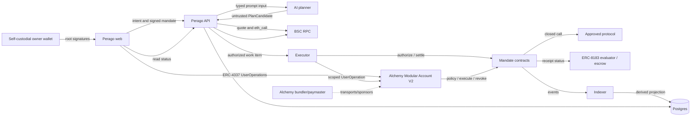
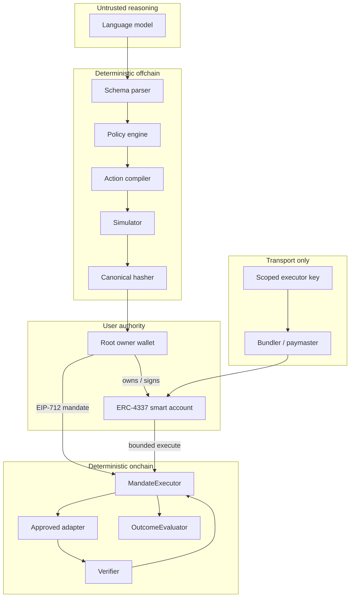
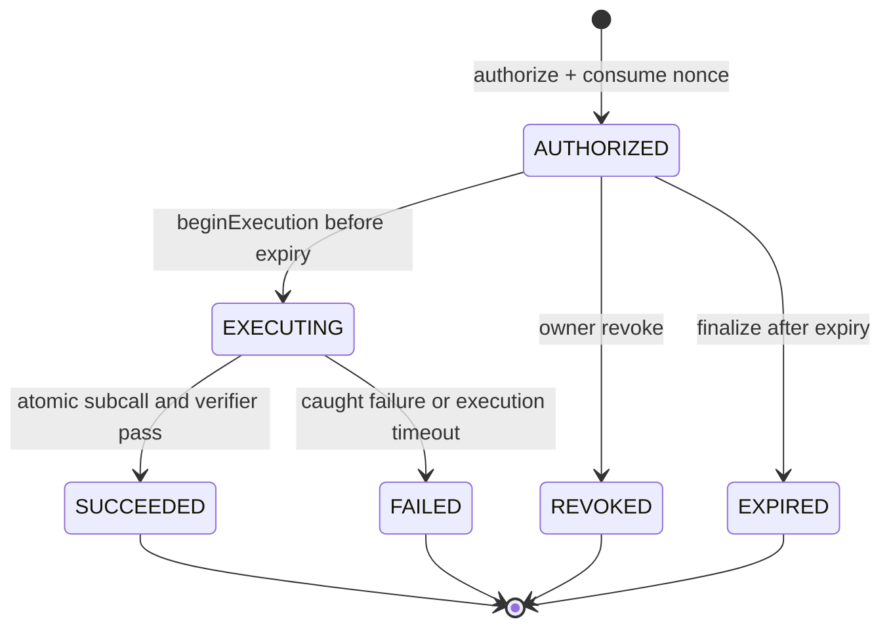
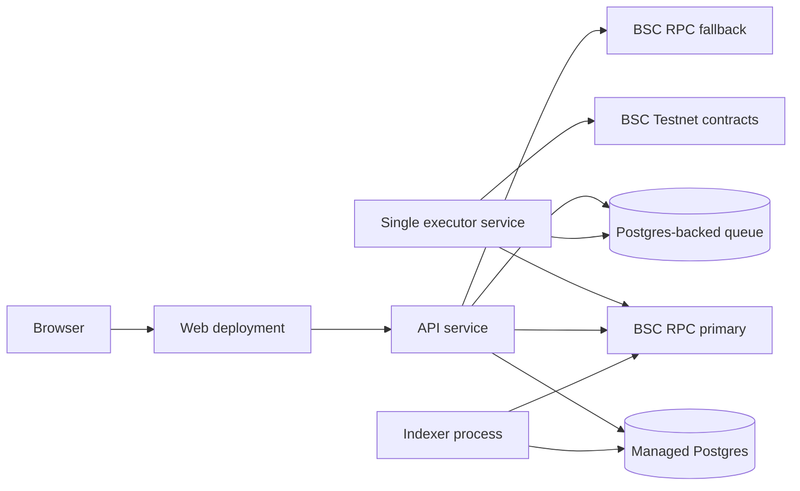

# Perago Architecture

**Status:** Proposed MVP architecture
**Product requirements:** [`../PRD.md`](../PRD.md)
**Data ownership:** [`ERD.md`](ERD.md)
**Contract details:** [`SMART-CONTRACT.md`](SMART-CONTRACT.md)

## 1. Architectural objective

Carry one user intent through planning, constrained authorization, execution, deterministic verification, and outcome-linked settlement without giving an AI or worker reusable wallet authority.

The architecture therefore optimizes for:

1. closed action schemas over arbitrary calls;
2. user-signed limits over model-generated permissions;
3. onchain terminal state over worker memory;
4. deterministic postconditions over subjective claims;
5. recoverable projections over authoritative offchain status;
6. a two-action MVP over generic protocol abstraction.

## 2. System context and trust boundaries



### Trust boundaries

| Boundary | Trusted input | Untrusted input | Required control |
| --- | --- | --- | --- |
| Owner wallet ↔ web | Root address, chain, root Task Mandate signature | Page state, injected provider errors | Recompute typed data, show exact limits, verify chain and recovered root signer. |
| Web/executor ↔ account abstraction | Canonical UserOperation and permission context | Wallet API, bundler, paymaster availability/response | Pin EntryPoint/account implementation, simulate UserOperation, cap sponsorship, reconcile onchain inclusion. |
| Smart account ↔ MandateExecutor | Root-owned account identity and narrowly scoped call | Session key or executor request | Account modules restrict target/function/spend/time; mandate contract independently verifies root signature and all task bounds. |
| API ↔ AI planner | Closed schema and non-secret context | All generated fields and prose | Parse strictly, reject unknown fields, deterministic policy intersection and calldata compilation. |
| API/executor ↔ RPC | Confirmed blocks after finality policy | RPC response, pending state, provider availability | Chain ID checks, redundant reads for critical state, block pinning, receipt confirmation. |
| Executor ↔ contract | Signed mandate and approved worker identity | Queue payload, retry timing | Onchain account/owner/digest/executor/nonce/expiry/policy checks; idempotent reconciliation. |
| Contract ↔ adapter/protocol | Immutable approved adapter and signed action | Token behavior, protocol revert/data | Exact temporary allowance, checks-effects-interactions, return/effect validation, reentrancy guard. |
| Verifier ↔ settlement | Onchain execution and deterministic evidence | Worker/API success claim | Settlement contract reads matching terminal receipt; no executor-only attestation. |
| Indexer ↔ database | Canonical confirmed event log | Reorged events, duplicate deliveries | Unique event key, confirmation depth, rollback/replay, append-only raw events. |

The AI planner, browser, API process, executor, session key, bundler, paymaster, Wallet API, queue, database, indexer, RPC provider, and external protocol are never root authorization. The self-custodial root signature, smart-account ownership, and MandateExecutor checks form the authorization path; confirmed chain events are the execution-status root.

## 3. Future monorepo and deployable shape

```text
apps/
  web/       Wallet connection, policy/mandate review, status and receipt reading
  api/       Intent API, compiler, policy engine, simulation, lifecycle, receipt queries
  executor/  Queue consumer, chain reconciliation, authorize/begin/perform/settle worker
packages/
  sdk/       Domain schemas, canonical encoders/hashes, ABIs, typed clients
  contracts/ Foundry contracts, scripts, unit/fuzz/invariant/fork tests
docs/
```

No package is created until its phase begins. Import boundaries are enforced by root [`AGENTS.md`](../../AGENTS.md).

### `apps/web`

- Connect a self-custodial external owner wallet and derive/deploy its supported Alchemy Modular Account V2 on the selected chain.
- Request canonical root signatures, sponsored/batched UserOperations, and narrowly scoped executor permissions without exposing keys.
- Collect Wallet Policy and TaskIntent inputs after user design direction exists.
- Render API-produced policy and simulation facts without inventing authorization state.
- Build typed data and account calls from `packages/sdk`.
- Read terminal state and public receipt evidence.
- Never hold keys, install broad session permissions, create arbitrary calldata, infer success, or become the only place policy is enforced.

### `apps/api`

- Authenticate wallet ownership for mutating offchain resources.
- Version Wallet Policies and coordinate activation of the onchain policy hash.
- Submit bounded context to the planner and parse a closed `CompiledPlan` union.
- Normalize tokens/amounts, perform deterministic policy intersection, compile adapter actions, and simulate.
- Store hashes and lifecycle projections, enqueue authorized work, and expose receipt queries.
- Never sign for the user, execute arbitrary targets, or mark onchain success from worker assertions.

### `apps/executor`

- Lease one work item at a time by mandate hash.
- Reconcile MandateExecutor, smart-account nonce, UserOperation, transaction, and session-permission state before every submission.
- Submit root-signed mandate authorization, scoped execution UserOperations, expiry finalization, and settlement calls when their preconditions hold.
- Persist UserOperation and transaction hashes immediately, wait for configured confirmations, and resume after restart.
- Never change a signed field, substitute an uncommitted route, escalate a session permission, or retry terminal authority.

### `packages/sdk`

- Own Zod schemas and inferred TypeScript types for all seven domain concepts.
- Own canonical JSON rules, hashes, EIP-712 definitions, ABIs, event decoders, reason codes, and API contracts.
- Expose pure policy and commitment helpers reusable by web, API, executor, and tests.
- Contain no database adapter, framework-specific request object, private key, or protocol network call.

### `packages/contracts`

- Own the policy-hash and mandate enforcement path, approved adapters, deterministic verifiers, receipt events, and ERC-8183 evaluator linkage.
- Provide deployment manifests by chain and bytecode provenance.
- Be non-upgradeable for the MVP unless the accepted security specification changes.

### Database and indexer

- Postgres stores user-authored offchain data, planner/simulation records, queue coordination, and chain-derived projections.
- The indexer stores every confirmed relevant log once and projects materialized status.
- A projection can be dropped and rebuilt from user-authored records plus chain logs.
- No database row can turn a failed onchain mandate into success.

## 4. Core component boundary



An LLM candidate becomes executable only after every deterministic stage passes, the root owner signs the final digest, and the smart-account call satisfies both account-module permissions and MandateExecutor checks.

## 5. End-to-end flows

### 5.1 Policy setup and activation

1. Web connects the user's external root wallet and deterministically derives the supported Modular Account V2 address for chain 97.
2. API issues a short-lived challenge bound to its domain and URI, chain 97, root owner, derived smart account, random nonce, issue time, and expiry.
3. The root wallet signs that exact message. API recovers the signer, locks and consumes the challenge once, creates or validates the wallet identity, and returns an opaque short-lived bearer token while persisting only its hash.
4. Before first use, web/API validate EntryPoint, factory, implementation, validation module, and permission-module bytecode against the pinned deployment manifest.
5. User provides policy fields; API validates addresses, decimals, enum values, duplicate assets/protocols, caps, slippage, recipients, expiry, and session ceiling.
6. SDK canonicalizes the immutable policy document and computes `policyHash`.
7. Web prepares one root-authorized UserOperation that registers/refreshes the root-owner epoch in MandateExecutor, sets `activePolicyHash`, and installs or replaces the executor permission with exact target/function/token/time ceilings. No root/global permission is allowed.
8. The Alchemy bundler simulates and submits the UserOperation; a paymaster may sponsor it under a Perago policy capped by chain, method, account, and budget.
9. API waits for configured confirmation depth and verifies smart account, root owner, EntryPoint, exact calldata and UserOperation events, policy hash, permission configuration, chain, canonical receipt blocks, and pinned bytecode directly onchain.
10. In one database transaction, the matching policy becomes `ACTIVE` and the previous active version becomes `SUPERSEDED`.
11. Indexer later confirms the same events; reconciliation repairs any missed API write.

A draft policy or provider-side permission record has no execution effect. Offchain `ACTIVE` is a projection of the confirmed onchain policy hash and account permission state.

### 5.2 Compile, intersect, simulate, and sign

```mermaid
sequenceDiagram
  actor User
  participant Web
  participant API
  participant AI as AI planner
  participant RPC as BSC RPC
  participant Owner as Root owner wallet
  participant SA as Smart account

  User->>Web: Natural-language TaskIntent
  Web->>API: Intent + active policy version + account
  API->>AI: Goal + smart account + closed candidate schema + catalog vocabulary (no policy limits)
  AI-->>API: Untrusted PlanCandidate (SWAP, STAKE, or CLARIFY)
  API->>API: Strict parse and normalize
  API->>API: Intersect every plan field with WalletPolicy
  alt conflict
    API-->>Web: REJECTED_POLICY + rule results
  else allowed
    API->>RPC: Read account balances, nonce, policy hash, code hashes, quote block
    API->>RPC: Quote + eth_call exact smart-account/adapter path
    RPC-->>API: Results at pinned block
    API->>API: Build SimulationResult and commitments
    API-->>Web: Plan, limits, risks, expiry, simulation
    Web->>Owner: Sign canonical EIP-712 TaskMandate
    Owner-->>Web: Root signature
    Web->>API: Signature + account + immutable hashes
    API->>API: Recover root signer; verify account ownership and freshness
    API-->>Web: SIGNED mandate accepted
  end
```

The API persists the raw user intent and the normalized plan separately. It never treats model prose as an action. The planner names only a kind, catalog adapter and token symbols, a decimal amount, and optional slippage or recipient values; it is not shown policy limits, so it transcribes the request instead of clamping it. The deterministic compiler resolves addresses and the pinned pool fee from the manifest catalog, converts amounts without rounding, reports every Wallet Policy rule in a fixed-order `PolicyDecision`, and builds a pre-quote `CompiledPlan`. Quote-derived minimum output and the chain-time deadline are not plan fields: simulation derives them and commits them into `actionHash`, so a re-quote never changes the plan or its hash. A simulation is valid only for the exact policy, plan, adapter implementation, nonce, block context, and expiry window recorded in its hash.

### 5.3 Authorize and execute

Authorization and accepted execution are separate onchain checkpoints. A single reverting protocol transaction would roll back its nonce/status writes and make the signature reusable. `authorize` consumes the mandate nonce; `beginExecution` irreversibly commits the one accepted attempt before the smart-account protocol call.

1. Executor leases the mandate and reads smart-account owner/module state, `activePolicyHash`, nonce state, and existing mandate status.
2. If the mandate or UserOperation is already known onchain, it reconciles instead of resubmitting.
3. Executor calls `authorize(mandate, rootSignature)` from its bound executor address. This transaction may be relayed, but the contract verifies the executor binding.
4. Contract verifies domain, root signer, smart account, owner epoch, executor, active policy hash, chain, contract, nonce, expiry, adapter, selector, and commitment shape.
5. Contract consumes the account nonce and records `AUTHORIZED` plus the mandate digest.
6. When all external preconditions are ready, executor calls `beginExecution(mandateHash)`. The contract records `EXECUTING` and the immutable execution-window deadline before protocol interaction.
7. After confirmation, executor prepares one UserOperation signed by the scoped executor/session key. It calls only `perform(mandate, action, executorProof, proofSignature)` through the account's `execute`; the exact `approve(MandateExecutor, maxInput)` was already granted by the root owner's own UserOperation (`D-004`), and the executor checked it before `authorize` and again before `beginExecution`.
8. The executor submits that UserOperation to the pinned EntryPoint with `handleOps` from its own address and zero UserOperation fees. A bundler or paymaster, when used, only transports or sponsors; neither can alter calls without invalidating the session signature and permission context.
9. MandateExecutor verifies `msg.sender == signed account`, executor proof, fresh expiry/window, and stored `EXECUTING` state.
10. An external self-call obtains no more than the signed input, grants the adapter an exact temporary allowance, and calls the fixed adapter entry point.
11. Adapter constructs protocol calldata from its closed action type and enforces signed economic limits in the protocol call.
12. The subcall clears allowance, returns recoverable residual input, and invokes the bound verifier.
13. The outer call records `SUCCEEDED` only when the subcall and verifier pass; it catches expected token/protocol/verifier reverts and records `FAILED`. Both are terminal.
14. Contract emits execution and receipt events. Executor only reports the confirmed UserOperation transaction/event.

A pre-authorization validation revert is not an execution attempt and does not consume a nonce. Once `beginExecution` succeeds, no account-abstraction, bundler, paymaster, or protocol failure restores authority. A missing/failed `perform` can only reach terminal `FAILED` through the immutable execution timeout.

### 5.4 Verify and settle

1. Adapter returns normalized execution evidence: spent amount, received/position delta, protocol transaction context, and adapter data hash.
2. Verifier reads only committed action parameters and chain state/evidence.
3. Verifier checks adapter-specific postconditions:
   - swap: recipient output balance delta is at least signed `minOutput`, input spent is no more than `maxInput`, and the route/adapter commitment matches;
   - stake: recipient position or receipt-token delta is at least signed `minPositionOut`, input spent is no more than `maxInput`, and the staking target matches.
4. MandateExecutor emits one terminal `ExecutionReceiptRecorded` event with the verification commitment and evidence hashes.
5. If an ERC-8183 job is bound, `OutcomeEvaluator.settle(jobId, mandateHash)` checks the executor's job binding and pinned adapter/verifier identity, requires a verified `SUCCEEDED` receipt, and checks the APEX client's account, pinned payment recipient, evaluator, hook, payment token, zero current fee, state, and deadline before its one-use completion.
6. A terminal `FAILED`, `REVOKED`, or `EXPIRED` mandate may call `OutcomeEvaluator.reject` to refund a funded/submitted job before its deadline. After the deadline, the worker may submit the exact pinned APEX `claimRefund(jobId)` for either a successful-but-unpaid or non-successful mandate; the recovery call remains permissionless for anyone and does not alter the mandate outcome. A changed platform fee blocks payment, not a still-safe refund: the refund gate checks the pinned code and matching job/client/escrow identity independently from payout economics. No caller-supplied verdict can cause payment.
7. Indexer projects the receipt from confirmed terminal events. `GET /receipts/:mandateHash` needs no wallet session: it scans that mandate from its persisted finalized cursor in ranges of at most 10 blocks, checks status and verification/failure commitments against MandateExecutor's finalized record, repairs a missing receipt from canonical retained logs, and returns only public commitments, transaction/block evidence, and explorer links derived from the chain definition. Without a reviewed evaluator deployment and a finalized matching APEX settlement event, a bound success is `PENDING` and a bound non-success is `INELIGIBLE`; a stored settlement hash or unrelated log never becomes a paid claim. A chain outage fails the read instead of returning stale payment truth. Fork-only payment evidence for `P6-003` is linked from [`BUILD-PLAN.md`](../BUILD-PLAN.md); its explorer links are not live transaction proof.

**P6-003 decision (2026-09-27):** A production simulation accepts an explicitly chosen, already funded/submitted APEX job ID from the authenticated wallet. At the pinned simulation block it verifies the job's smart-account client, configured immutable evaluator/provider/hook/payment token, positive budget, submitted status, deadline beyond the mandate expiry and execution window, and reviewed runtime/proxy implementation pins; it then commits `(commerceContract, jobId)` to the simulated and signed mandate. The executor key never creates jobs, approves tokens, or funds escrow. Before each pre-terminal worker submission it rechecks the same job and proxy identity at one chain block, refusing an invalid or expired job rather than consuming authority. The worker's independent `SETTLE` and `REJECT_JOB` transactions share the existing persisted-byte/lease reconciliation path: `SUCCEEDED` may request `settle` only, terminal non-success may request `reject` only, and a finalized failed payout never changes mandate success. `SETTLING` and `REFUNDING` are operational worker states, not mandate truth.

For a public `CONFIRMED` payment, scan bounded finalized blocks and require the pinned evaluator's `CommerceJobSettled` log, matching kernel `JobCompleted` and `PaymentReleased` logs in the same successful transaction, the immutable job/mandate/evaluator identity and payment-token/provider/budget at the finalized block, and the onchain `settled` bit. Store raw chain events with block hash once, reproject by mandate hash, and include the payment transaction/block/log evidence in the receipt. Do not derive payment from `executions.settlement_tx_hash` or a worker claim. A bound successful job that expires or is rejected without payment is explicitly unpaid, never presented as pending forever; a non-success remains ineligible even when its refund is still outstanding.

The executor cannot provide a boolean that causes payment. The evaluator derives eligibility from contract state.

### 5.5 Revoke and expire

- **Before authorization:** the root owner submits a direct or sponsored smart-account call that invalidates a nonce/nonce range or changes the active policy hash; the old signature can no longer authorize.
- **After authorization, before `beginExecution`:** the root owner calls `revoke(mandateHash)` through the smart account. The contract accepts the first valid terminal transition between revoke, expiry, and begin.
- **After expiry while authorized:** anyone may call `finalizeExpired(mandateHash)`. `beginExecution` checks expiry and cannot race successfully after the boundary.
- **After `beginExecution`:** revoke is no longer allowed; the exact UserOperation either records success/failure or the immutable timeout finalizes `FAILED`.
- **After a terminal state:** revoke, begin, perform, and expiry calls revert or return existing status without external side effects, as specified by the ABI.

## 6. State machines

### 6.1 Mandate contract state



`EXECUTING` persists between the confirmed `beginExecution` checkpoint and `perform`. Expected adapter/protocol/verifier failures are caught and committed as `FAILED`; a missing or wholly reverted UserOperation cannot return to `AUTHORIZED` and becomes `FAILED` after the immutable execution window.

### 6.2 Execution worker state

```text
QUEUED -> LEASED -> AUTHORIZING -> AUTHORIZED -> EXECUTING -> VERIFYING -> SETTLING -> TERMINAL
LEASED -> REJECTED               (authorize reverts at a finalized block; no authority was ever granted)
LEASED | AUTHORIZED -> RETRY_WAIT -> LEASED   (approval, balance, or chain unavailable)
```

Worker state is not product truth. Implemented in `P4-002` (`apps/executor/src/{worker,reconcile,chain,transactions,user-operation}.ts`, `apps/api/src/services/executions.ts`):

- The API derives `status` from the mandate projection at the chain's `finalized` block (a verified direct read of MandateExecutor logs, cross-checked against `mandateRecord`) plus the one pending transaction; the worker never writes it. The log read runs in chunks of at most 10 blocks (the chain-97 Alchemy `eth_getLogs` limit) from a forward-only per-mandate cursor in `indexer_checkpoints` (stream `mandate:0x<hash>`), advanced in the same transaction that applies the events. A bound successful mandate enters `SETTLING` until finalized payout or refund evidence; an unbound mandate can finish after the terminal receipt.
- Each step starts with `reconcile`, then a fresh `latest` read. The worker signs nothing while a pending transaction is unresolved or while `latest` disagrees with the finalized projection.
- A transaction's hash and exact signed bytes are persisted through the API, which checks sender, target, function, and arguments, before the bytes are broadcast. A dropped transaction is rebroadcast byte-for-byte; a transaction whose nonce another transaction consumed is retired only once that nonce is finalized, and the step is re-decided from chain state.
- Authorization and the accepted attempt wait for the exact root approval and balance (`D-004`); a missing precondition parks the job in `RETRY_WAIT` without spending the nonce.
- At most one UserOperation is ever included per mandate. After inclusion the only remaining step is `finalizeStalledExecution` once the window closes; expiry after authorization is closed with `finalizeExpired`.
- Leases expire by the database clock; a crashed worker's job is re-leased after its lease and resumes from the persisted state.

### 6.3 ERC-8183 job state

Perago follows the draft standard's canonical states: `Open`, `Funded`, `Submitted`, then `Completed`, `Rejected`, or `Expired`. Perago does not redefine this state machine. A mandate stores its bound `jobId` and commerce contract; the OutcomeEvaluator may complete only a submitted matching job after mandate success, or reject an already terminal non-success while funded/submitted. Upstream APEX expiry and refund safety remain available without evaluator cooperation.

## 7. Idempotency, replay, and consistency

### Idempotency keys

| Operation | Key |
| --- | --- |
| Create task intent | Smart-account address + client request ID |
| Compile plan | Task ID + policy hash + compiler version |
| Simulate | Plan hash + block number + account/adapter code hashes |
| Submit mandate | Mandate EIP-712 digest |
| Queue execution | Mandate digest |
| Submit execution | Smart-account address + UserOperation nonce + mandate digest |
| Store chain event | Chain ID + transaction hash + log index |
| Settle job | Commerce contract + job ID + mandate digest |

The canonical confirmed-event idempotency key stays `(chain ID, transaction hash, log index)`. Raw history includes block hash so a transaction re-included at the same log index in another block retains both immutable versions; only one is `CONFIRMED` at a time.

### Replay controls

- EIP-712 domain binds chain ID and MandateExecutor address.
- Struct binds root owner, smart account, owner epoch, executor, nonce, expiry, active policy hash, adapter, selector, economics, recipient, and all commitments.
- `usedNonce[account][nonce]` is written at authorization before execution is possible.
- Account-module permissions bind session key, EntryPoint/account, target, functions, spend, and expiry; they never replace mandate checks.
- UserOperation signature/nonces prevent account-level replay; MandateExecutor nonce prevents semantic replay through another transport.
- Adapter action bytes are re-hashed onchain and must equal `actionHash`.
- Settlement records one consumed `(commerceContract, jobId)` binding.

### Reorg handling

- Raw events are stored with block hash and confirmation status.
- A transaction is confirmed only when its block is at or below the chain's `finalized` tag (`SC-D-005`; on chain 97 that trails `latest` by 1-2 blocks). Before that, API status is `PENDING_CONFIRMATION`, not terminal. The P3-002 policy verifier still counts a fixed depth; moving it to the `finalized` rule belongs to the next API task that touches confirmation.
- If a block hash changes and the batch names a stored canonical parent event, the indexer marks affected events orphaned and replays projections from that ancestor. If the parent has no stored event, it refuses the batch instead of inventing ancestry; recovery then requires a trusted block-header rescan. The public receipt path reads only finalized blocks and fails closed on a status/commitment mismatch.
- Public receipt reads reconcile independently of the executor, including after it stops. The read and worker share a per-mandate finalized cursor; a public read whose checkpoint advanced concurrently aborts rather than overwriting newer evidence. A terminal response joins only `CONFIRMED` events, so orphaned terminal logs are not served; a mismatch with MandateExecutor's finalized status or verification/failure hash blocks the response.
- The worker checks canonical transaction receipts before progressing to the next transition.

## 8. Failure and degradation behavior

| Failure | Behavior | User-visible result |
| --- | --- | --- |
| Planner unavailable/invalid output | Do not compile or infer a fallback action; return the task to `DRAFT`. | Retryable planning failure (`PLANNER_UNAVAILABLE`, `PLANNER_OUTPUT_INVALID`); no mandate. |
| Ambiguous or unsupported goal | Planner returns `CLARIFY`; nothing is compiled. | `INTENT_NEEDS_CLARIFICATION` with one question; restate as a new request. |
| Policy conflict | Persist structured decision; do not simulate. | Exact rule/value conflict. |
| Quote unavailable/stale | Do not sign; refresh from a new pinned block. | Simulation unavailable/stale. |
| RPC disagreement | Stop critical transition and compare another endpoint or wait. | Chain data temporarily uncertain. |
| Signature invalid | Reject before queueing. | Signer/domain/field mismatch reason. |
| Authorization transaction uncertain | Reconcile digest/nonce and receipt; never create a new nonce automatically. | Pending confirmation. |
| Adapter/protocol reverts | Contract catches expected call failure, clears authority path, records `FAILED`. | Terminal failed receipt; no payment. |
| Verifier returns false/reverts | Record terminal `FAILED`; do not settle. | Failed postcondition evidence. |
| Indexer down | Chain execution may continue; serve explicit stale projection or direct read. | Indexing delayed, never false success. |
| Database down | Do not accept new offchain workflow; executor reconciles already durable jobs if safe. | Service unavailable; chain truth intact. |
| Settlement unavailable | Keep successful receipt; retry identical settlement after reconciliation. | Execution succeeded, payment pending. |
| Session provider unavailable | Use MandateExecutor path; never fall back to a raw key. | Session optimization unavailable. |

No degradation mode widens authority, changes a signed action, or reports an unconfirmed success.

## 9. Hackathon deployment topology



MVP deployment choices:

- web as a stateless deployment;
- API, executor, and indexer as separate process commands, deployable together if platform limits require;
- one Postgres instance and a database-backed leased-job queue; no separate message broker;
- one active executor replica initially, with database leases and onchain idempotency allowing a second only when measured;
- BSC Testnet as the default live environment; a pinned BSC mainnet fork is an explicitly labeled contingency for unavailable third-party testnet contracts;
- secrets held in deployment secret stores, never web bundles or database rows.

## 10. Observability

Every offchain request and worker attempt carries `traceId`, `taskId`, and `mandateHash` when known. Structured logs include stage, chain ID, adapter ID, transaction hash, block number, attempt number, latency, and stable reason code. They exclude natural-language intent by default, signatures unless required for a redacted debug sample, authorization headers, key/session material, and raw provider payloads containing secrets.

Minimum metrics:

- compile and simulation latency/error rate;
- policy rejection counts by rule ID;
- queue age and lease recoveries;
- authorization/execution/settlement submission and confirmation latency;
- mandates by terminal state and reason code;
- stale simulation and RPC disagreement count;
- indexer head lag and reorg depth;
- allowance cleanup failures and unexpected contract reverts.

Minimum alerts for a hosted demo: executor queue age, indexer lag, repeated RPC errors, unexpected whole-transaction execution revert, and successful receipt with unsettled job beyond threshold.

## 11. Architecture decisions

| ID | Decision | Rationale | Rejected alternative |
| --- | --- | --- | --- |
| ADR-001 | Use Alchemy Modular Account V2 for ERC-4337 UX and keep a minimal MandateExecutor for task authority. | BNB Testnet bundler/sponsorship is officially supported, while one-use/effect verification remains provider-independent and product-critical. | Privy-native embedded smart wallets, unsupported BSC testnet providers, UI-only limits, or raw delegated keys. |
| ADR-002 | Treat smart-account permissions as defense in depth, never mandate authorization. | A session key must not be able to create its own root Task Mandate or widen persistent policy. | Session-only enforcement. |
| ADR-003 | Separate onchain authorization from execution. | External-call failure must not restore signature authority. | Single reverting execute transaction whose nonce write rolls back. |
| ADR-004 | Use one closed adapter entry selector with typed action commitments. | Shrinks the callable surface and keeps protocol calldata out of AI control. | Arbitrary target/calldata allowlist. |
| ADR-005 | Use adapter-specific verifiers. | Swap balance output and staking position output are different facts. | Generic LLM evaluator or transaction-success check. |
| ADR-006 | Keep raw events append-only and projections rebuildable. | Chain is authoritative and reorgs/duplicate delivery are expected. | Mutable receipt rows as sole truth. |
| ADR-007 | Use a Postgres-backed queue for MVP. | One datastore is sufficient and easier to operate. | Redis/Kafka before throughput requires them. |
| ADR-008 | Defer ERC-8004. | Identity/reputation does not improve bounded authority or the initial demo. | Adding a registry only for standards count. |
| ADR-009 | Bind, but do not over-persist, natural language onchain. | Hashes prove correspondence without publishing sensitive intent. | Raw intent text in contract storage/events. |
| ADR-010 | Start simulation with protocol quote, pinned reads, UserOperation simulation, and `eth_call`. | Meets current actions with no extra simulation provider; evidence limits remain explicit. | Third-party simulator before a demonstrated need. |

## 12. Open architecture decisions

Only externally dependent choices remain open:

1. `D-004` is closed: the root owner grants the exact per-task allowance in its own UserOperation; a session key never receives an `approve` selector (`SMART-CONTRACT.md` §7).
2. Fallback public bundler capability, if Alchemy is unavailable.
3. Independent RPC pair for critical reads. (Confirmation depth is closed by `SC-D-005`: the `finalized` tag.)

Closed since the last revision, with evidence in [`../BUILD-PLAN.md`](../BUILD-PLAN.md) and [`../evidence/`](../evidence/):

- The pinned Alchemy EntryPoint, account, and module deployments: owner-paid and sponsored UserOperations, bounded session execution, and every forbidden-shape rejection are proven on chain 97.
- `D-002`: the documented CAKE Pool deployment works for a smart account, including the 0.1% early-withdrawal fee, so it stays the stake target.
- `D-003`: Perago settles on the official BNB APEX ERC-8183 kernel as the job evaluator, with the Perago-owned inert hook the kernel requires, and the pinned United Stables (`U`) payment token. The APEX evaluator router and its optimistic policy are rejected because policy registration is owner-gated and optimistic settlement is not deterministic.

Each is assigned a validation task in [`../BUILD-PLAN.md`](../BUILD-PLAN.md); none authorizes a placeholder implementation or fabricated integration claim.
