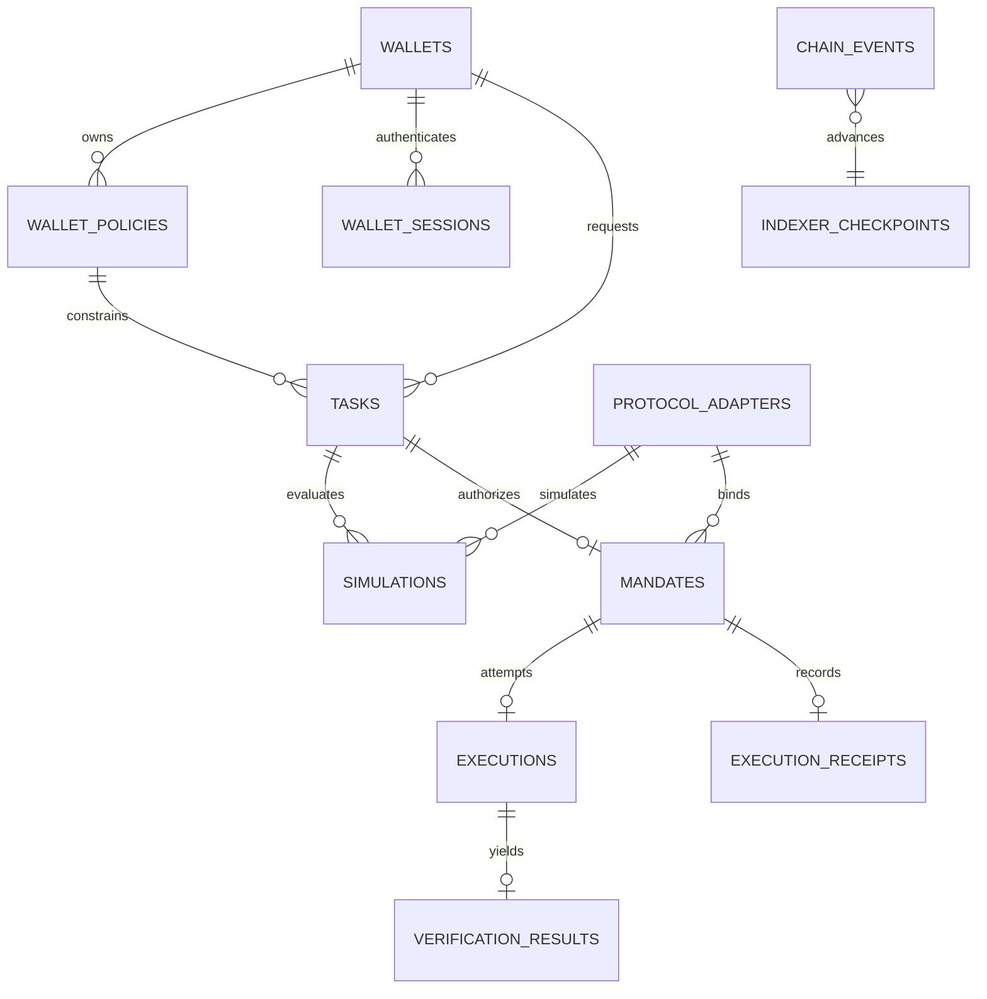

# Perago Data Model

**Status:** Implemented locally through `P3-002`; live policy transition evidence and hosted deployment remain pending
**System flows:** [`ARCHITECTURE.md`](ARCHITECTURE.md)
**Contract states:** [`SMART-CONTRACT.md`](SMART-CONTRACT.md)

## 1. Ownership rule

Perago separates authoritative facts from recoverable projections.

| Fact | Authority |
| --- | --- |
| Smart-account owner, installed permissions, active policy hash, mandate nonce/status, protocol effects, verification receipt, ERC-8183 job status | Confirmed onchain state and logs |
| Raw user intent, private policy document, planner output, simulation detail, queue lease | Postgres |
| Onchain status shown by the API | Rebuildable Postgres projection |
| Model explanation or worker report | Non-authoritative evidence only |

A database update never makes an onchain action valid. A model or worker cannot write terminal success directly. Raw confirmed events are append-only; derived tables are replayable.

## 2. Identifier conventions

- Internal IDs: UUIDv7 generated by the API.
- EVM addresses: 20-byte binary (`bytea`) or normalized lowercase hex at API boundaries; never case-sensitive identity text.
- Hashes/digests: fixed 32-byte binary (`bytea`).
- Chain IDs: `bigint`, never a display name.
- Token amounts and nonces: numeric precision sufficient for `uint256`; application decodes to `bigint`, never floating point.
- Timestamps: UTC `timestamptz`; onchain timestamps are also stored as their source `uint256` seconds when exact comparison matters.
- Transaction/log identity: `(chain_id, transaction_hash, log_index)`.
- Onchain mandate identity: `(chain_id, mandate_executor, mandate_hash)`.
- ERC-8183 job identity: `(chain_id, commerce_contract, job_id)`.

Canonical encodings and hashes are owned by `packages/sdk`. JSON documents are stored for audit, but identity always uses their versioned canonical hash.

## 3. Relationship overview

There is at most one onchain execution attempt per mandate. Infrastructure retries are recorded on the same execution row and transaction-attempt child data, not as new business attempts.

## 4. Enums

### `policy_status`

`DRAFT | ACTIVATING | ACTIVE | SUPERSEDED | REVOKED`

- `ACTIVE` requires a confirmed matching onchain policy hash.
- `SUPERSEDED` and `REVOKED` are terminal for new tasks.

### `task_status`

`DRAFT | COMPILING | REJECTED_POLICY | READY_TO_SIMULATE | SIMULATED | READY_TO_SIGN | SIGNED | CANCELLED`

`SIGNED` means the EIP-712 signature was recovered and all referenced records were still fresh. It does not mean onchain authorization.

### `mandate_status`

`SIGNED | AUTHORIZING | AUTHORIZED | EXECUTING | SUCCEEDED | FAILED | REVOKING | REVOKED | EXPIRING | EXPIRED`

The stable product states from the PRD are `SIGNED`, `AUTHORIZED`, `EXECUTING`, `SUCCEEDED`, `FAILED`, `REVOKED`, and `EXPIRED`. `AUTHORIZING`, `REVOKING`, and `EXPIRING` are pending-transaction projections and cannot be reported as terminal.

### `execution_status`

`QUEUED | LEASED | AUTHORIZING | AUTHORIZED | EXECUTING | VERIFYING | SETTLING | RETRY_WAIT | TERMINAL`

This is operational state only. Chain-derived mandate and receipt status wins.

### `verification_status`

`PASSED | FAILED | ERROR`

`ERROR` is a deterministic inability to complete the check and produces terminal mandate `FAILED`; it is not treated as pass or retried under the same authority.

### `receipt_status`

`SUCCEEDED | FAILED | REVOKED | EXPIRED`

### `chain_event_status`

`OBSERVED | CONFIRMED | ORPHANED`

### `adapter_status`

`PROPOSED | VALIDATING | ACTIVE | PAUSED | RETIRED`

Only `ACTIVE` adapters may enter a new simulation or mandate.

## 5. Tables

### 5.1 `wallet_auth_challenges`

One-use root-wallet authentication messages created before a wallet session exists.

| Column | Type | Constraints / meaning |
| --- | --- | --- |
| `id` | uuid | PK |
| `domain` / `uri` | text | not null; deployment origin binding |
| `chain_id` | bigint | not null |
| `account_address` / `root_owner_address` | bytea | exactly 20 bytes |
| `nonce` | text | unique, cryptographically random |
| `message` | text | immutable exact signed message |
| `expires_at` / `created_at` | timestamptz | expiry must follow creation |
| `consumed_at` | timestamptz | nullable; may transition from null exactly once |

The message binds domain, URI, root owner, derived smart account, chain, nonce, issue time, and expiry. A row lock plus the immutability trigger makes verification one-use under concurrency.

### 5.2 `wallets`

One row per smart account on a chain.

| Column | Type | Constraints / meaning |
| --- | --- | --- |
| `id` | uuid | PK |
| `chain_id` | bigint | not null |
| `account_address` | bytea | not null; ERC-4337 smart account holding assets |
| `root_owner_address` | bytea | not null; self-custodial EOA authorized to sign Task Mandates |
| `account_type` | text | not null; closed value such as `ALCHEMY_MODULAR_V2` |
| `account_version` | text | not null; verified deployed implementation version |
| `entry_point_address` | bytea | not null |
| `factory_address` | bytea | nullable for EIP-7702 accounts |
| `owner_epoch` | bigint | not null default 0; increments on root-owner change |
| `created_at` | timestamptz | not null |
| `updated_at` | timestamptz | not null |

Constraints:

- unique `(chain_id, account_address)`;
- unique `(chain_id, root_owner_address, account_address)`;
- addresses have exactly 20 bytes;
- an ownership change is accepted only from confirmed account events/reads and invalidates active policy and unsigned work.

No private key, embedded-wallet share, session key, or recovery material is stored.

### 5.3 `wallet_sessions`

Short-lived API authorization for a verified wallet identity.

| Column | Type | Constraints / meaning |
| --- | --- | --- |
| `token_hash` | bytea | PK; 32-byte SHA-256 hash, never the bearer token |
| `wallet_id` | uuid | FK `wallets.id`, not null |
| `expires_at` / `created_at` | timestamptz | expiry must follow creation |
| `revoked_at` | timestamptz | nullable; may transition from null exactly once |

The opaque bearer token is returned once. Authentication hashes the presented token and accepts only an unexpired, unrevoked row.

### 5.4 `wallet_policies`

Immutable, versioned policy documents.

| Column | Type | Constraints / meaning |
| --- | --- | --- |
| `id` | uuid | PK |
| `wallet_id` | uuid | FK `wallets.id`, not null |
| `version` | integer | positive, monotonically increasing per wallet |
| `schema_version` | text | not null |
| `status` | `policy_status` | not null |
| `policy_document` | jsonb | not null; canonical fields described by PRD |
| `policy_hash` | bytea | 32 bytes, not null |
| `permission_document` | jsonb | exact narrow session permission, nullable before submission |
| `permission_hash` | bytea | 32-byte commitment, nullable before submission |
| `permission_call_data` | bytea | exact install/uninstall calldata |
| `permission_user_operation_hash` | bytea | 32-byte account-operation identity |
| `permission_tx_hash` | bytea | 32-byte EntryPoint transaction identity |
| `activation_call_data` | bytea | exact smart-account call to `setAccountPolicy` |
| `activation_user_operation_hash` | bytea | 32-byte account-operation identity |
| `activation_tx_hash` | bytea | nullable until activation submission |
| `activation_block_number` | bigint | nullable until confirmed |
| `created_at` | timestamptz | not null |
| `activated_at` | timestamptz | nullable |
| `terminal_at` | timestamptz | nullable for supersede/revoke |

Constraints:

- unique `(wallet_id, version)` and `(wallet_id, policy_hash)`;
- at most one `ACTIVE` row per wallet via partial unique index;
- immutable `policy_document`, `policy_hash`, and `version` after insert;
- `ACTIVE` requires exact permission and activation calldata, UserOperation hashes, transaction hashes, confirmation block, and activation time;
- activation evidence becomes immutable when the draft leaves `DRAFT`;
- only `DRAFT → ACTIVATING → ACTIVE`, `ACTIVE → SUPERSEDED`, and legal revocation transitions are accepted;
- `SUPERSEDED`/`REVOKED` require `terminal_at`.

Daily cap usage is derived from confirmed `SUCCEEDED` and economically spent `FAILED` receipt evidence for the policy's declared day window. The corresponding smart-account permission uses the same token ceiling and expiry as an onchain backstop. Do not maintain an unbounded or non-rebuildable mutable counter.

### 5.5 `tasks`

User-authored intent plus the deterministic compilation result.

| Column | Type | Constraints / meaning |
| --- | --- | --- |
| `id` | uuid | PK |
| `wallet_id` | uuid | FK, not null |
| `wallet_policy_id` | uuid | FK, not null |
| `client_request_id` | text | not null; idempotency key scoped to wallet |
| `status` | `task_status` | not null |
| `intent_text_ciphertext` | bytea | encrypted at rest; nullable after retention purge |
| `intent_hash` | bytea | 32 bytes, not null |
| `intent_document` | jsonb | normalized non-secret TaskIntent fields |
| `compiled_plan` | jsonb | nullable until compilation pass |
| `plan_hash` | bytea | nullable; 32 bytes |
| `compiler_version` | text | nullable; immutable with plan |
| `policy_decision` | jsonb | not null after compile; rule-by-rule outcomes |
| `policy_decision_hash` | bytea | nullable; 32 bytes |
| `created_at` | timestamptz | not null |
| `updated_at` | timestamptz | not null |
| `cancelled_at` | timestamptz | nullable |

Constraints:

- unique `(wallet_id, client_request_id)`;
- a passing plan has a non-null plan, plan hash, compiler version, and decision hash;
- a rejected task cannot have a mandate;
- unknown JSON fields are rejected before persistence, not silently retained.

### 5.6 `simulations`

Immutable result for one exact plan at one chain context.

| Column | Type | Constraints / meaning |
| --- | --- | --- |
| `id` | uuid | PK |
| `task_id` | uuid | FK, not null |
| `adapter_id` | uuid | FK `protocol_adapters.id`, not null |
| `sequence` | integer | positive refresh counter per task |
| `status` | text | `PASSED | REVERTED | STALE | ERROR` |
| `chain_id` | bigint | not null |
| `block_number` | bigint | not null |
| `block_hash` | bytea | 32 bytes, not null |
| `adapter_code_hash` | bytea | 32 bytes, not null |
| `quote_expires_at` | timestamptz | not null |
| `request_document` | jsonb | exact action and read set |
| `result_document` | jsonb | balances, max input, min output, gas, protocol, recipient, risks, revert data |
| `simulation_hash` | bytea | 32 bytes, not null |
| `created_at` | timestamptz | not null |

Constraints:

- unique `(task_id, sequence)` and `simulation_hash`;
- immutable after insert except a derived `STALE` marker;
- signable only when `PASSED`, unexpired, canonical block, active policy unchanged, adapter still `ACTIVE`, and current adapter code hash matches.

### 5.7 `mandates`

One signed authorization and its chain-derived lifecycle projection.

| Column | Type | Constraints / meaning |
| --- | --- | --- |
| `mandate_hash` | bytea | PK; EIP-712 digest, 32 bytes |
| `task_id` | uuid | unique FK, not null |
| `simulation_id` | uuid | FK, not null |
| `wallet_id` | uuid | FK, not null |
| `wallet_policy_id` | uuid | FK, not null |
| `adapter_id` | uuid | FK, not null |
| `chain_id` | bigint | not null |
| `mandate_executor_address` | bytea | not null |
| `root_owner_address` | bytea | not null |
| `account_address` | bytea | not null |
| `executor_address` | bytea | not null; executor/session public key bound by mandate |
| `nonce` | numeric(78,0) | not null |
| `expires_at_chain_seconds` | numeric(78,0) | not null |
| `typed_data` | jsonb | exact versioned EIP-712 payload |
| `signature` | bytea | root-owner signature; public authorization data, access logged |
| `status` | `mandate_status` | not null |
| `erc8183_contract` | bytea | nullable only when payment disabled for a local test |
| `erc8183_job_id` | numeric(78,0) | nullable with contract |
| `authorize_tx_hash` | bytea | nullable |
| `terminal_tx_hash` | bytea | nullable |
| `terminal_reason_code` | text | nullable until terminal |
| `created_at` | timestamptz | not null |
| `authorized_at` | timestamptz | nullable |
| `terminal_at` | timestamptz | nullable |

Constraints:

- unique `(chain_id, mandate_executor_address, account_address, nonce)`;
- unique `(chain_id, erc8183_contract, erc8183_job_id)` when payment binding exists;
- typed data digest must equal PK and recovered root signer must match `root_owner_address` and current wallet owner epoch;
- signed fields and signature are immutable;
- terminal states require terminal transaction, reason, and timestamp;
- state changes after `SIGNED` are accepted only from confirmed events or a verified direct chain read.

### 5.8 `executions`

Operational record for the single allowed mandate attempt.

| Column | Type | Constraints / meaning |
| --- | --- | --- |
| `id` | uuid | PK |
| `mandate_hash` | bytea | unique FK, not null |
| `status` | `execution_status` | not null |
| `lease_owner` | text | nullable; opaque worker instance ID |
| `lease_expires_at` | timestamptz | nullable |
| `submission_attempts` | integer | nonnegative; infrastructure submissions, not business attempts |
| `authorize_tx_hash` | bytea | nullable |
| `execute_user_operation_hash` | bytea | nullable; ERC-4337 UserOperation identifier |
| `execute_tx_hash` | bytea | nullable until included |
| `settlement_tx_hash` | bytea | nullable |
| `last_error_code` | text | nullable; stable and redacted |
| `next_retry_at` | timestamptz | nullable |
| `created_at` | timestamptz | not null |
| `updated_at` | timestamptz | not null |

Constraints:

- one row per mandate;
- active lease requires owner and future expiry;
- retries reuse identical signed payload/action and reconcile chain/UserOperation status first;
- `TERMINAL` requires matching mandate terminal state, not just a worker decision.

Detailed transport attempts may be stored in a bounded JSON audit field or structured logs; a separate table is added only if production diagnosis requires it.

### 5.9 `verification_results`

One immutable normalized verifier result per execution.

| Column | Type | Constraints / meaning |
| --- | --- | --- |
| `id` | uuid | PK |
| `execution_id` | uuid | unique FK, not null |
| `verifier_id` | bytes32 | not null; signed verifier commitment/implementation identity |
| `status` | `verification_status` | not null |
| `reason_code` | text | not null |
| `observed_document` | jsonb | normalized input spent, output/position delta, recipient, protocol evidence |
| `evidence_hash` | bytea | 32 bytes, not null |
| `chain_id` | bigint | not null |
| `transaction_hash` | bytea | not null |
| `block_number` | bigint | not null |
| `log_index` | integer | not null |
| `created_at` | timestamptz | not null |

Constraints:

- unique `(chain_id, transaction_hash, log_index)`;
- immutable;
- `PASSED` is valid only when the matching contract receipt event says success.

### 5.10 `execution_receipts`

Public, immutable receipt projection. Private text is represented only by hashes.

| Column | Type | Constraints / meaning |
| --- | --- | --- |
| `mandate_hash` | bytea | PK/FK |
| `status` | `receipt_status` | not null |
| `policy_hash` | bytea | 32 bytes, not null |
| `intent_hash` | bytea | 32 bytes, not null |
| `plan_hash` | bytea | 32 bytes, not null |
| `simulation_hash` | bytea | 32 bytes, not null |
| `action_hash` | bytea | 32 bytes, not null |
| `postcondition_hash` | bytea | 32 bytes, not null |
| `verification_hash` | bytea | 32 bytes, nullable only for revoke/expiry before execution |
| `authority_consumed` | boolean | always true for an onchain receipt |
| `authorize_tx_hash` | bytea | not null |
| `execution_tx_hash` | bytea | nullable for revoke/expiry |
| `settlement_tx_hash` | bytea | nullable until/when settled |
| `erc8183_contract` | bytea | nullable with job ID |
| `erc8183_job_id` | numeric(78,0) | nullable with contract |
| `terminal_block_number` | bigint | not null |
| `terminal_at` | timestamptz | not null |

Constraints:

- immutable except settlement fields, which transition once from null to a confirmed matching settlement;
- `SUCCEEDED` requires a `PASSED` verification result;
- non-success cannot have a settlement transaction that completed payment;
- every field must reconcile to confirmed contract logs.

### 5.11 `chain_events`

Append-only raw event ledger.

| Column | Type | Constraints / meaning |
| --- | --- | --- |
| `chain_id` | bigint | composite PK |
| `transaction_hash` | bytea | composite PK |
| `log_index` | integer | composite PK |
| `block_number` | bigint | not null |
| `block_hash` | bytea | 32 bytes, not null |
| `contract_address` | bytea | not null |
| `topic0` | bytea | 32 bytes, not null |
| `topics` | jsonb | not null |
| `data` | bytea | not null |
| `decoded_name` | text | nullable only for temporarily unknown ABI |
| `decoded_args` | jsonb | nullable |
| `status` | `chain_event_status` | not null |
| `observed_at` | timestamptz | not null |
| `confirmed_at` | timestamptz | nullable |
| `orphaned_at` | timestamptz | nullable |

Rows are never deleted during normal reconciliation. An event may move `OBSERVED → CONFIRMED` or `OBSERVED/CONFIRMED → ORPHANED`; payload fields are immutable.

### 5.12 `indexer_checkpoints`

| Column | Type | Constraints / meaning |
| --- | --- | --- |
| `chain_id` | bigint | composite PK |
| `stream_name` | text | composite PK; identifies contract set/ABI version |
| `next_block_number` | bigint | not null |
| `last_canonical_block_hash` | bytea | 32 bytes, not null |
| `confirmation_depth` | integer | positive |
| `updated_at` | timestamptz | not null |

Checkpoint update and the corresponding event batch commit in one transaction. On hash mismatch, the indexer rewinds to the last canonical ancestor and replays projections.

### 5.13 `protocol_adapters`

Small persisted deployment registry, not a protocol marketplace.

| Column | Type | Constraints / meaning |
| --- | --- | --- |
| `id` | uuid | PK |
| `chain_id` | bigint | not null |
| `kind` | text | `SWAP | STAKE` |
| `slug` | text | stable internal ID |
| `status` | `adapter_status` | not null |
| `adapter_address` | bytea | not null |
| `adapter_code_hash` | bytea | 32 bytes, not null |
| `verifier_id` | bytea | 32 bytes, not null |
| `protocol_name` | text | not null |
| `protocol_target_address` | bytea | not null |
| `entry_selector` | bytea | 4 bytes, not null |
| `config_document` | jsonb | token/pool IDs and immutable bounds; no secrets |
| `source_url` | text | official deployment/source evidence |
| `validated_block_number` | bigint | not null before `ACTIVE` |
| `created_at` | timestamptz | not null |
| `retired_at` | timestamptz | nullable |

Constraints:

- unique `(chain_id, slug)` and `(chain_id, adapter_address, adapter_code_hash)`;
- `ACTIVE` requires source URL, validated block, code hash, and successful integration probe;
- retired versions remain addressable for historical receipt verification.

## 6. State-transition constraints

### Wallet Policy

| From | To | Required evidence |
| --- | --- | --- |
| DRAFT | ACTIVATING | Confirmed exact policy and permission evidence is persisted before the terminal transition in the same transaction; pending submissions remain `DRAFT` |
| ACTIVATING | ACTIVE | Confirmed exact `AccountPolicySet` event, successful permission UserOperation, current `accountConfig`, canonical receipt blocks, and pinned code hashes |
| ACTIVE | SUPERSEDED | Confirmed activation of a later version |
| DRAFT/ACTIVE | REVOKED | User cancellation before activation or confirmed zero/new policy hash invalidating it |

### Task

| From | To | Guard |
| --- | --- | --- |
| DRAFT | COMPILING | Active canonical policy exists |
| COMPILING | REJECTED_POLICY | At least one deterministic rule fails |
| COMPILING | READY_TO_SIMULATE | Strict plan schema and all rules pass |
| READY_TO_SIMULATE | SIMULATED | Exact simulation passes |
| SIMULATED | READY_TO_SIGN | Freshness and all commitments revalidated |
| READY_TO_SIGN | SIGNED | Root-owner signature recovers and digest matches |
| Nonterminal | CANCELLED | No mandate has been authorized |

A changed policy, adapter code hash, chain, owner epoch, quote deadline, or canonical block invalidates the simulation and returns the task to `READY_TO_SIMULATE`; no row is silently mutated.

### Mandate

Confirmed contract events drive `AUTHORIZED`, `SUCCEEDED`, `FAILED`, `REVOKED`, and `EXPIRED`. Pending states are replaced or rolled back after receipt/reorg reconciliation. Terminal states never transition.

## 7. API-to-table map

| API capability | Reads | Writes |
| --- | --- | --- |
| Request authentication challenge | none | immutable `wallet_auth_challenges` row |
| Verify challenge | locked challenge + derived account | consume challenge once, upsert `wallets`, create hashed `wallet_sessions` row |
| Create/read policy | `wallets`, `wallet_policies` | new `wallet_policies` draft |
| Activate policy | `wallets`, `wallet_policies`, `chain_events` | activation projection after user submission |
| Create intent | `wallets`, active policy | `tasks` |
| Compile/intersect | `tasks`, `wallet_policies`, `protocol_adapters` | plan/decision fields on same pre-sign task |
| Simulate/refresh | task + adapter + chain reads | append `simulations`, advance task reference/status |
| Build/sign mandate | task + fresh simulation + wallet | immutable `mandates`, task `SIGNED`, `executions` queue row |
| Read lifecycle | mandate/execution/receipt projections | none |
| Revoke | mandate + chain | pending projection only; confirmed event finalizes |
| Public receipt | `execution_receipts`, `verification_results`, confirmed events | none |
| Executor lease | queued executions + mandate | lease/retry operational fields only |
| Index events | checkpoint + RPC | append events, update projections/checkpoint transactionally |

## 8. Synchronization rules

1. API writes a signed mandate before queueing execution in the same transaction.
2. Executor reads chain state before each submission and after any timeout.
3. Submitted transaction/UserOperation hashes are persisted before waiting for inclusion.
4. Indexer event identity makes duplicate delivery harmless.
5. Terminal projections require configured confirmation depth.
6. Direct reads may repair a missing projection but must retain the raw block/transaction evidence.
7. Reorg repair marks orphaned events and rebuilds affected projections; it does not edit event payloads.
8. An adapter address is insufficient identity; code hash and verifier ID are part of simulation/mandate evidence.
9. Root-owner or smart-account implementation change invalidates outstanding unsigned work and requires policy reactivation. Authorized mandate behavior follows its immutable onchain binding and explicit revocation.

## 9. Privacy and retention

| Data | Default retention |
| --- | --- |
| Raw intent text | Encrypted; delete 30 days after terminal state unless user opts to retain |
| Intent/plan/policy/simulation hashes | Indefinite for receipt verification |
| Full immutable policy and typed plan | Account lifetime plus 90 days; export/delete subject to onchain hash permanence |
| Signatures | Until mandate terminal plus 90 days; public by nature but access/audit restricted |
| Wallet authentication challenges and hashed bearer sessions | Delete after expiry plus operational audit window; raw bearer tokens are never stored |
| Executor/session signing private keys, wallet shares, recovery data | Never stored |
| Raw chain events and public receipts | Indefinite |
| Structured application logs | 14 days for hackathon, redacted |
| Planner request/response | 7 days maximum, no secrets; disable provider training where configurable |

Public receipt responses never expose raw intent text, private policy detail, IP addresses, user identifiers, or model prompts. Onchain hashes cannot be erased and must not encode low-entropy sensitive text without a domain-separated salt/commitment scheme.

## 10. Deliberately omitted tables

No users/profile table is required for the wallet-first MVP; `wallets` is the principal. No agents, listings, categories, reputation, leaderboard, token prices, generic transactions, or marketplace jobs table is created. The narrowly scoped `wallet_sessions` table is API authentication state, not a wallet/session signing-key store. ERC-8183 job state remains onchain and its identity/status is projected through mandate/receipt fields. Add a separate job projection only if query load or multiple jobs per mandate later proves it necessary.
